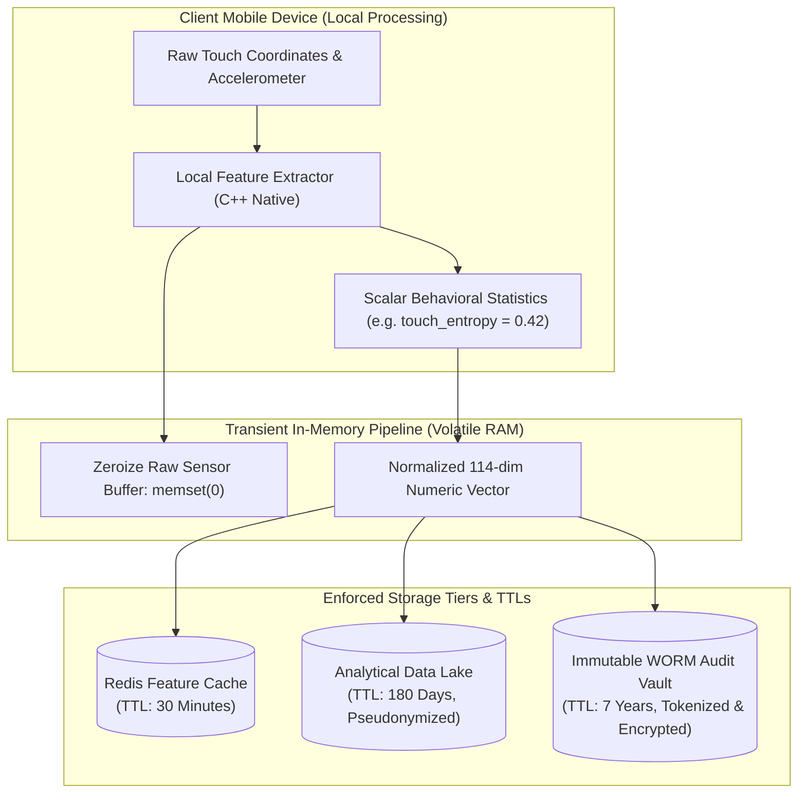

# Privacy Architecture & Data Protection Specification

## 1. Regulatory Context & Privacy-by-Design Mandate

Kurukshetra processes behavioral biometrics, device interaction metrics, and financial transaction histories. Under international data privacy frameworks (EU General Data Protection Regulation / GDPR Art. 9, UK Data Protection Act 2018, California Consumer Privacy Act / CCPA, and India Digital Personal Data Protection Act / DPDPA 2023), behavioral telemetry and biometric characteristics receive stringent regulatory scrutiny.

Kurukshetra enforces a **Privacy-by-Design Architecture** founded on four fundamental principles:
1. **Data Minimization (GDPR Art. 5(1)(c))**: Collecting strictly the minimal features required to detect psychological coercion; prohibiting speculative telemetry collection.
2. **Zero Raw Biometric Persistence (GDPR Art. 9 Special Category Data Safeguard)**: Raw sensor streams are processed ephemerally in RAM and immediately purged.
3. **Cryptographic Pseudonymization & Tokenization**: Core databases store salted cryptographic hashes (`account_hash`, `device_hash`), completely decoupling risk scoring from direct real-world identities.
4. **Enforced Tiered Retention & Automated Cryptographic Shredding**: Different data categories have mathematically enforced Time-To-Live (TTL) expiration schedules.

---

## 2. Telemetry Processing & Ephemeral RAM Buffering

### 2.1 The Prohibition on Raw Biometric Storage
Traditional biometric authentication systems store facial templates or fingerprint minutiae. In contrast, Kurukshetra evaluates **behavioral biometrics** (keystroke dynamics, touch surface contact size, flight times). 
- **Strict Architecture Rule**: Storing raw $(x, y, t, p)$ touch coordinate time-series is strictly prohibited. Storing raw audio of phone calls is an illegal wiretap felony and is architecturally barred.
- **Processing Flow**:
  1. The mobile SDK collects touch gestures across a rolling 3-second sliding window inside a localized native memory buffer.
  2. The local native module computes three statistical summary metrics:
     - `touch_flight_time_variance` (floating point variance).
     - `touch_pressure_deviation` (standard deviation).
     - `hesitation_dwell_time_ms` (integer duration).
  3. The raw gesture buffer is immediately overwritten with zeros (`memset(0)`). Only the scalar summary values are transmitted over the mTLS connection.

### 2.2 Telemetry Privacy Matrix

| Telemetry Element | Processed in RAM? | Stored in Long-Term DB? | Masked / Tokenized? | Regulatory Justification |
| :--- | :---: | :---: | :---: | :--- |
| **Phone Call State** (`active_call = TRUE`) | Yes | Yes (Boolean only) | No (Boolean flag) | Legitimate Interest (Fraud Prevention - GDPR Art. 6(1)(f)) |
| **Phone Call Audio / Content** | **NEVER** | **NEVER** | N/A (Hardware microphone access never requested) | Wiretap / Privacy Violation |
| **Remote Access App Name** (`AnyDesk`) | Yes | Yes (180 days max) | Stored as enum ID | Fraud prevention & security |
| **User Full Legal Name** | No | No (Tokenized) | Salted SHA-256 Hash | Data minimization |
| **Raw Keystroke Content** | **NEVER** | **NEVER** | N/A (Key values never read; timing intervals only) | Surveillance prohibition |
| **Touch Flight Time Variance** | Yes | Yes (180 days) | Scalar Float Only | Special Category Safeguard |

---

## 3. Pseudonymization, Tokenization & Key Isolation

To prevent data breach catastrophic exposure, the risk evaluation pipeline operates entirely on **Pseudonymized Token Identifiers**:
1. **Sender and Payee Accounts**: Transformed at the Edge Gateway into a 64-character hexadecimal string using HMAC-SHA256:
   $$\text{AccountToken} = \text{HMAC-SHA256}(\text{IBAN}, \text{Salt}_{\text{bank}})$$
2. **Salt Management**: The HMAC salt is stored in a dedicated Hardware Security Module (HSM) with access restricted to the Ingress Gateway. The internal Risk Engine, GNN Subgraph Embedder, and Decision Engine never receive or store the plain-text bank account number or IBAN.
3. **Re-Identification Boundary**: Only authorized Tier-2 SOC fraud investigators or compliance officers with dual-key approval can execute a reverse lookup to unmask account identities during active legal investigations.

---

## 4. Tiered Retention Schedule & Cryptographic Shredding

Data retention is strictly governed by automated lifecycle rules enforced by database partition drop jobs and AWS S3 lifecycle configurations:

| Data Layer | Storage Engine | Retention Period (TTL) | Deletion Mechanism |
| :--- | :--- | :--- | :--- |
| **L1 Session Cache** | Redis Sentinel RAM | **30 Minutes** | Redis `EXPIRE` key automated eviction |
| **L2 Intermediate Telemetry** | Kafka Event Topics | **7 Days** | Kafka topic log compaction & segment deletion |
| **L3 Feature Store Analytics** | ClickHouse Analytical DB | **180 Days** | Partition drop (`DROP PARTITION WHERE date < NOW() - INTERVAL 180 DAY`) |
| **L4 Compliance Audit Dossiers** | AWS S3 Object Lock (WORM) | **7 Years** | Mandatory regulatory archive (FATF/Basel III); automated purge after 2,555 days |

### Cryptographic Shredding
When a customer exercises their **GDPR Article 17 "Right to Erasure" (Right to be Forgotten)**:
- Kurukshetra deletes the user's specific cryptographic token key from the HSM.
- Without this key, all historically stored analytical telemetry vectors associated with that token become mathematically irrecoverable ciphertext, achieving complete cryptographic erasure across distributed backups without violating the 7-year statutory financial transaction retention requirement.

---

## 5. Privacy Compliance Verification & Independent Audit

1. **Automated Leakage Scanners**: Continuous integration tests run automated DLP (Data Loss Prevention) scripts against all test outputs and log streams to guarantee zero unmasked credit card PANs, phone numbers, or email addresses appear in application logs.
2. **Data Protection Impact Assessment (DPIA)**: Formally documented DPIA validating that behavioral biometric scalar processing meets the proportionality test under GDPR Art. 35.
