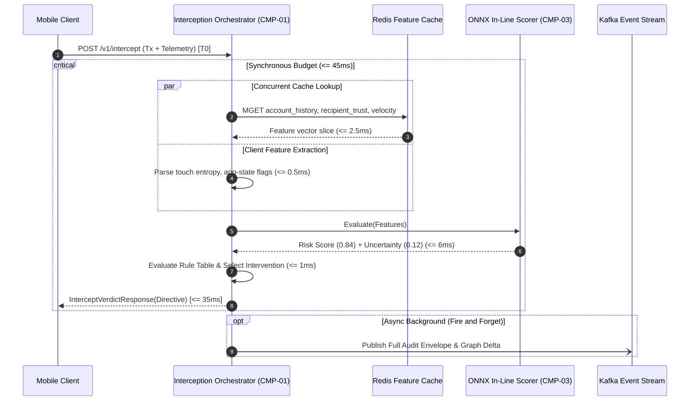

# Real-Time Architecture & Latency Budget

## 1. Executive Summary & Processing Philosophy

Kurukshetra operates in the synchronous payment interception path where any artificial delay directly penalizes legitimate customer user experience, while any excessive latency risks payment engine timeout and default clearing.

To reconcile high-assurance fraud and scam interception with consumer banking ergonomics, Kurukshetra employs an **Asymmetric Dual-Path Architecture**:
1. **Synchronous Critical Path (Pre-Execution In-Line Interception)**: A deterministic, sub-45ms P99 SLA microsecond pipeline evaluating transaction intent, pre-aggregated behavioural features, and client heuristics.
2. **Asynchronous Streaming & Deep Evaluation Path**: A parallel event-driven pipeline processing rich graph traversals, LLM-driven deep forensic audits, cross-rail velocity aggregation, and post-transaction law-enforcement / mule-account containment feeds.

```mermaid
flowchart TD
    subgraph Client_App ["Client Banking App (Zone 0)"]
        UI["Payment Flow UI"]
        SDK["Kurukshetra Client SDK"]
        InterFilter["Intervention Modal Interceptor"]
    end

    subgraph Sync_Path ["Synchronous In-Line Critical Path (Budget: 45ms P99)"]
        Ingress["API Gateway / TLS Termination"]
        Orch["Interception Orchestrator (CMP-01)"]
        FeatureCache[("Local In-Memory Cache / Redis")]
        InLineScorer["LightGBM / ONNX Scorer (CMP-03)"]
        PolicyEngine["Deterministic Rule & Policy Router (CMP-05)"]
    end

    subgraph Async_Path ["Asynchronous Streaming Path (Decoupled Kafka)"]
        KafkaBus[["Kafka Event Backbone"]]
        GNNWorker["GNN Subgraph Embedder (CMP-04)"]
        MuleAlertService["Cross-Rail Mule Containment (CMP-07)"]
        AuditWorker["WORM S3 Ingestion (CMP-06)"]
        SOCStream["Analyst Triage Queue (CMP-08)"]
    end

    UI -->|1. User taps Pay| SDK
    SDK -->|2. mTLS Payload (Telemetry + Tx)| Ingress
    Ingress -->|3. gRPC Unary| Orch
    Orch <-->|4. Fetch Features (<=2ms)| FeatureCache
    Orch -->|5. Run Scorer (<=8ms)| InLineScorer
    InLineScorer --> Orch
    Orch -->|6. Evaluate Directives (<=2ms)| PolicyEngine
    PolicyEngine -->|7. Action Directive| Orch
    Orch -->|8. Sync Response (<=45ms)| SDK
    
    SDK -->|If Intervene: Block PIN Pad| InterFilter
    SDK -->|If Allow: Prompt PIN| UI

    Orch -.->|9. Fire-and-Forget Async Publish| KafkaBus
    KafkaBus --> GNNWorker
    KafkaBus --> MuleAlertService
    KafkaBus --> AuditWorker
    KafkaBus --> SOCStream
```

---

## 2. Latency Budget Breakdown (Critical Path: P99 $\le 45\text{ms}$)

The critical path encompasses the instant the user presses "Proceed to Pay" in the client banking application up to the point the Kurukshetra verdict (`ALLOW`, `INTERVENE_STEP_UP`, `INTERVENE_COACH`, `INTERVENE_FREEZE`) is received by the client SDK to determine whether the biometric/PIN entry pad should be rendered.

| Stage | Operation Description | P50 (ms) | P95 (ms) | P99 (ms) | Hard Timeout (ms) | Failure Fallback |
| :--- | :--- | :--- | :--- | :--- | :--- | :--- |
| **T1: Network Ingress** | Cellular/Wi-Fi TLS 1.3 handoff to Regional Edge Gateway | 12.0 | 18.0 | 22.0 | 25.0 | Circuit breaker trigger |
| **T2: Payload Unpack** | Protobuf deserialization, signature verification, schema check | 0.4 | 0.8 | 1.2 | 2.0 | Fail-open (`ALLOW` + flag) |
| **T3: Context Fetch** | Concurrent read from Redis Sentinel / In-Memory cache | 1.2 | 2.5 | 4.0 | 5.0 | Degrade to static features |
| **T4: ML Inference** | C++ ONNX Runtime LightGBM scoring + Platt calibration | 2.8 | 5.5 | 8.5 | 10.0 | Heuristic rule-only fallback |
| **T5: Decision Policy** | Deterministic tier router, safety override, directive gen | 0.6 | 1.2 | 1.8 | 2.5 | Default to Step-up auth |
| **T6: Egress Encode** | Protobuf serialization and response delivery | 0.3 | 0.6 | 1.0 | 1.5 | Fast network transmit |
| **T7: Network Egress** | Gateway to mobile client return transmission | 3.5 | 5.0 | 6.5 | 8.0 | Client SDK local timeout |
| **Buffer / Jitter** | OS scheduling jitter, TCP retransmission margin | 1.2 | 2.4 | 0.0 | -- | Absorbed in hard deadline |
| **Total End-to-End** | Complete Client-to-Client Roundtrip | **22.0** | **36.0** | **45.0** | **50.0** | **Fail-Open Safe State** |

### Hard Ceiling Guarantee
The client SDK enforces a strict **`50ms` absolute timeout**. If no directive packet is received within 50ms from request dispatch, the SDK local fallback triggers:
1. Logs `ERROR_BACKEND_TIMEOUT` locally.
2. Emits an asynchronous telemetry ping to the bank gateway.
3. Automatically executes `FAIL_OPEN_ALLOW` for low-to-medium value transactions ($\le \$250$) or invokes local heuristic client rules for high-value transactions ($> \$250$), preventing user lockouts while preserving baseline safety.

---

## 3. Concurrency, Throughput & Queueing Strategy

### 3.1 Peak Workload Sizing
- **Nominal Production Volume**: 15,000 transactions per second (TPS).
- **Diurnal Spike / Festival Peak**: 45,000 TPS.
- **Micro-burst Headroom**: Engineered for 75,000 TPS burst capacity over a 60-second window.

### 3.2 Threading & Non-Blocking I/O Model
- **Language**: Go 1.22+ runtime for `CMP-01 Interception Orchestrator`.
- **I/O Engine**: Epoll-based non-blocking network listener (`netpoll`) with persistent HTTP/2 gRPC streams over mTLS.
- **Goroutine Pool Isolation**:
  - `WorkerPool_Sync`: Fixed-size worker pool (512 workers per container instance) handling in-flight unary evaluations.
  - `WorkerPool_Telemetry`: Separate unbounded buffered channel (100,000 depth) for telemetry ingestion.
  - Zero lock contention on critical read paths using lock-free read-copy-update (RCU) pointer swaps for dynamic configuration and threshold tables.

### 3.3 Asynchronous Decoupling via Apache Kafka
Any operation exceeding 2ms SLA is strictly prohibited on the synchronous thread.
All heavy calculations are offloaded to Kafka topics partitioned by `account_id_hash`:
- `kurukshetra.events.telemetry`: Raw telemetry snapshots for training and offline analytics.
- `kurukshetra.events.scoring-audit`: Input features, calculated scores, and decision output.
- `kurukshetra.events.graph-update`: Real-time edge mutations for transaction graph updates.
- `kurukshetra.events.mule-broadcast`: Immediate broadcast to interbank mule containment queues.



---

## 4. Caching & State Pre-Warming Architecture

To eliminate cold-cache penalties during the critical 45ms window, Kurukshetra employs an **Active Pre-Warming Strategy**:

1. **Session-Level Pre-Warming**:
   - The moment a user initiates a payee search or selects an existing contact from their address book, the banking app emits an anticipatory event: `PAYEE_FOCUS_INIT`.
   - The Gateway routes this event to the `Context Engine`, which immediately hydrates the Redis Sentinel cache with:
     - The sender's 24-hour velocity counters.
     - The recipient's composite graph risk score and mule risk tier.
     - The historical dyadic interaction history (first-time payment flag, relationship age).
   - By the time the user enters the amount and clicks "Pay" (typically 3 to 15 seconds later), 100% of the required context features are pre-resident in local L1/L2 Redis RAM.

2. **Redis In-Memory Topology**:
   - Cluster configuration: 3-node Redis Sentinel per regional availability zone.
   - P99 read latency: $< 1.5\text{ms}$ over local VPC loopback.
   - Cache data structure: Packed binary Protobuf blobs indexed by SHA-256 account hashes with 30-minute sliding TTL.

---

## 5. Fail-Safe Circuit Breaker & Graceful Degradation

The system implements a multi-stage **Hardware and Software Circuit Breaker** (Netflix Hystrix / Resilience4j pattern in Go):

```text
[Normal Execution: Score >= Threshold -> Intervene]
       │
       ├── Cache Timeout (> 5ms) ──────────► [Degraded Tier 1: Fallback to Client Telemetry Only]
       │
       ├── Model Scorer Timeout (> 10ms) ──► [Degraded Tier 2: Fallback to Deterministic Heuristics]
       │
       └── Orchestrator Crash / Total Hang ─► [Degraded Tier 3: Client SDK Local Fail-Open (Allow)]
```

1. **Tier 1 (Feature Degradation)**:
   - If Redis fails to respond within 5ms, the cache call aborts. The model scorer runs using only the features supplied in the direct HTTP payload (client touch entropy, remote access flags, new device flags). Risk score confidence is penalized with higher epistemic uncertainty ($\sigma$).
2. **Tier 2 (Model Degradation)**:
   - If the ONNX scoring engine exceeds 10ms or throws a memory exception, the system instantly engages the **Static Heuristic Matrix**:
     - *If (Active Call == TRUE AND Remote Access Tool == ACTIVE) -> Force STEP_UP_AUTHENTICATION.*
     - *If (Account Age < 48h AND Amount > $1,000) -> Force COOLING_OFF_DELAY.*
3. **Tier 3 (Client Fail-Open Safe Harbor)**:
   - If the entire banking network or Kurukshetra backend experiences an outage, the mobile SDK prevents transaction lockup by failing open, preserving core banking utility while streaming telemetry to client storage for retrospective analysis.

---

## 6. Verification & Latency Benchmarking Plan

- **Synthetic Load Testing**: Vegetta / k6 distributed load generators executing 20,000 simulated client requests per second.
- **Latency Distribution Assertion**:
  - P50: $\le 22.0\text{ms}$
  - P90: $\le 30.0\text{ms}$
  - P99: $\le 45.0\text{ms}$
  - Maximum observed: $\le 49.5\text{ms}$ (zero requests permitted to hit client timeout).
- **Chaos Ingress Testing**: Inject 10% packet drop and 50ms synthetic latency spikes into the Redis cache; verify that the system degrades to Tier 1 within 5ms and executes cleanly within 45ms.
