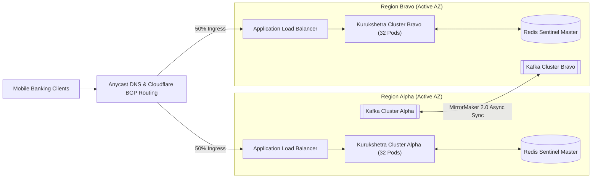

# Resilience, High Availability & Fault Tolerance Architecture

## 1. Resilience Philosophy & High-Availability SLA

As an in-line interceptor for real-time payment rails, Kurukshetra must adhere to the international standard for core payment switches: **99.999% Availability ("Five Nines")**, corresponding to no more than **5.26 minutes of unscheduled downtime per calendar year**.

To achieve this extreme level of resilience without jeopardizing consumer payments, Kurukshetra enforces two fundamental architectural rules:
1. **The Fail-Open Principle**: Under any catastrophic infrastructure failure, unrecoverable exception, or network partition, the synchronous path **must fail open (`ALLOW`)** for standard consumer transactions rather than paralyzing the national payment grid.
2. **Graceful Degradation via Decoupled Fallback Tiers**: Partial dependency failures (e.g. cache outage or GNN service delay) must seamlessly degrade model capability without dropping the transaction or exceeding the 45ms latency budget.

```mermaid
flowchart TD
    subgraph Primary_Sync_Path ["Primary Critical Path"]
        Ingress["API Gateway"]
        Cache["Redis Feature Cache"]
        Scorer["LightGBM / ONNX Scorer"]
        Policy["Policy Engine"]
    end

    subgraph Degradation_Tiers ["Graceful Degradation Tiers"]
        Tier1["Degradation Tier 1: Client Payload Only<br/>(Cache Timeout > 5ms)"]
        Tier2["Degradation Tier 2: Static Heuristic Matrix<br/>(Scorer Timeout > 10ms)"]
        Tier3["Degradation Tier 3: Client SDK Fail-Open<br/>(Gateway Timeout > 50ms)"]
    end

    Ingress --> Cache
    Cache -->|Healthy (<= 2ms)| Scorer
    Cache -->|Timeout / Down| Tier1
    Tier1 --> Scorer
    
    Scorer -->|Healthy (<= 8ms)| Policy
    Scorer -->|Timeout / Down| Tier2
    Tier2 --> Policy

    Ingress -->|Total Cluster Down| Tier3
```

---

## 2. Dependency Failure Matrix & Degradation Behaviors

| Dependency Component | Failure Mode | Detect Timeout | Immediate System Impact | Automated Fallback Behavior | System Recovery Mechanism |
| :--- | :--- | :--- | :--- | :--- | :--- |
| **Redis Feature Cache** | Primary node crash or network partition | 5.0 ms | Loss of 24h velocity and dyadic history features | **Degradation Tier 1**: Risk engine runs with missing values; model scales epistemic uncertainty $\sigma$ upward; policy engine clamps maximum action to Step-Up. | Redis Sentinel triggers automatic replica failover in $< 3.0\text{s}$. |
| **ONNX Risk Scorer (`CMP-03`)** | Segmentation fault or thread deadlock in C++ runtime | 10.0 ms | Inability to compute calibrated statistical risk score | **Degradation Tier 2**: Instantly invoke the Go Static Heuristic Rule Table (checks for active call + remote access tool directly). | Kubernetes restarts container pod via liveness probe; traffic diverted to warm replicas. |
| **Kafka Event Backbone** | Broker cluster saturation or leader election stall | Non-blocking | Zero impact on synchronous critical path | Asynchronous buffer in Go memory (100,000 events); overflow spilled to local SSD disk queue. | Asynchronous consumer reconnects and replays disk backlog when Kafka brokers stabilize. |
| **GNN Subgraph Service (`CMP-04`)** | GPU out-of-memory or complex graph query timeout | Non-blocking | Stale mule network embeddings in Redis | Redis preserves last-known good mule embedding (30-minute stale grace period); falls back to basic account age heuristic. | Worker daemon restarts GNN sub-process; refreshes graph partitions. |
| **SOC Copilot LLM (`CMP-08`)** | LLM API rate limit or model server down | 20.0 s | Inability to synthesize dynamic investigation dossiers | Case assigned to human analyst queue with raw TreeSHAP and SQL tables; tagged `COPILOT_UNAVAILABLE`. | Exponential backoff retry with circuit breaker on LLM gateway. |
| **Entire Kurukshetra Core** | Complete regional datacenter blackout | 50.0 ms | Total loss of connection to bank mobile app | **Degradation Tier 3 (Client SDK Fail-Open)**: Mobile SDK fails open, allowing payment to proceed while logging local diagnostic error. | Route53 / Cloudflare DNS failover routes traffic to secondary active-active cloud region. |

---

## 3. High Availability Architecture: Active-Active Multi-Region Deployment

To eliminate single points of failure (SPOF), Kurukshetra runs in a multi-region, active-active topology across two geographically isolated cloud regions (e.g. AWS `eu-west-1` and `eu-central-1`, or `ap-south-1a` and `ap-south-1b`):



### Key Architectural Characteristics:
1. **Zero-Shared-State Synchronous Ingress**: Each active region contains its own complete, independent read-replica cache and ONNX scoring pods. No cross-region synchronous network calls are permitted in the 45ms path.
2. **Asynchronous Cross-Region Replication**: Apache Kafka MirrorMaker 2.0 synchronizes transaction events and velocity counters asynchronously between regions with sub-second replication lag.
3. **Stateless Compute Pods**: All Go orchestrator pods (`CMP-01`) and C++ ONNX scoring pods are completely stateless, permitting horizontal auto-scaling from 16 to 128 instances within 45 seconds during sudden traffic surges.

---

## 4. Partial Feature Dropout Tolerance

Financial machine learning models often crash or produce wild predictions when upstream feature pipelines fail.

Kurukshetra's model architecture is explicitly engineered for **Partial Feature Dropout**:
- During LightGBM model training, random feature dropout (15% probability per feature group) is injected to train the trees to handle missing inputs cleanly.
- If the Redis cache fails or returns a partial vector, missing values are encoded as `NaN`.
- LightGBM automatically routes `NaN` inputs along dedicated missing-value split paths determined during training, ensuring that prediction degradation is graceful and continuous rather than catastrophic.

---

## 5. Chaos Engineering & Resilience Verification Plan

Kurukshetra undergoes continuous automated chaos testing in staging environments using Chaos Mesh:
1. **Latency Injection Test**: Introduce 100ms artificial network delay on the Redis connection; verify that 100% of requests successfully trip the 5ms circuit breaker and execute degraded scoring within 35ms.
2. **Pod Termination Test**: Randomly terminate 50% of active `CMP-01` pods under 20,000 TPS load; verify zero dropped connections and P99 latency remains $< 45\text{ms}$.
3. **Kafka Blackout Test**: Sever all network connectivity to the Kafka brokers; verify that the synchronous payment clearance continues operating with 0% error rate while local RAM buffers spool events safely.
