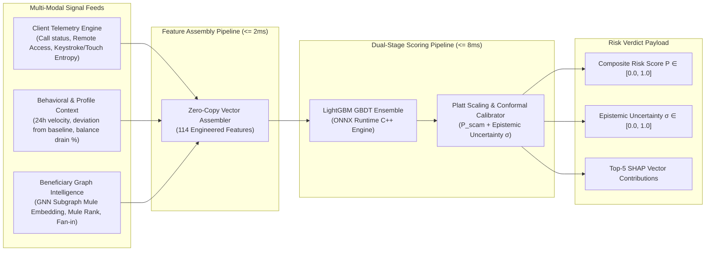

# Detection & Risk Engine Architecture

## 1. Architectural Philosophy & Engine Scope

The Kurukshetra Risk Engine (`CMP-03`) is engineered to address the fundamental structural challenge of Authorized Push Payment (APP) scam detection: **the legitimate account holder is intentionally authorizing the payment from their authentic device using valid credentials.**

Traditional payment fraud detection systems (which look for stolen session tokens, credential stuffing, and IP anomalies) fail because the technical identity matches the authentic user. The Kurukshetra Risk Engine evaluates **Psychological Coercion, Relational Asymmetry, and Structural Mule Footprints** across three decoupled feature dimensions:

---

## 2. Multi-Modal Feature Assembly Specification

The engine consumes a normalized 114-dimensional dense floating-point vector assembled within $\le 2\text{ms}$ from memory-resident data structures.

### Feature Taxonomy (114 Features Total)

| Feature Group | Dim | Key Features | Extraction Source | Max Latency |
| :--- | :--- | :--- | :--- | :--- |
| **G1: Psychological Coercion Telemetry** | 28 | `active_phone_call_duration_sec`, `call_type` (GSM vs VoIP), `remote_access_tool_active` (AnyDesk, TeamViewer), `screen_sharing_active`, `touch_flight_time_variance`, `touch_pressure_deviation`, `keystroke_dwell_jitter`, `hesitation_duration_before_pay` | Mobile SDK Ingress Payload | 0.4ms |
| **G2: Transactional & Velocity Anomalies** | 34 | `amount_ratio_to_30d_max`, `balance_drain_percentage`, `transactions_past_1h`, `transactions_past_24h`, `time_since_last_tx_sec`, `is_round_number`, `high_risk_amount_tier` | Redis Feature Cache (Sender) | 1.0ms |
| **G3: Dyadic Relationship Profile** | 22 | `is_first_time_payee`, `payee_relationship_age_hours`, `prior_inflow_from_payee`, `payee_name_edit_distance_to_known_contacts`, `payee_bank_mismatch_flag` | Redis Feature Cache (Dyad) | 0.8ms |
| **G4: Graph Mule Intelligence** | 30 | `subgraph_mule_score`, `gnn_embedding_vector` (16 dims), `in_degree_past_24h`, `out_degree_past_24h`, `rapid_dispersion_ratio`, `mule_community_cluster_id` | GNN Pre-Computed Subgraph (Recipient) | 0.5ms |

---

## 3. Model Architecture & Inference Pipeline

### 3.1 Model Selection Rationale: LightGBM GBDT over Raw Deep Neural Nets
For synchronous pre-execution clearance, **LightGBM (Gradient Boosted Decision Trees)** is selected over deep neural networks or LLMs for four non-negotiable architectural reasons:
1. **Sub-10ms Deterministic Execution**: LightGBM compiled to ONNX runtime evaluates 114 features across 250 trees in $< 4.5\text{ms}$ on commodity x86_64 AVX2 CPUs, with zero GPU dependency.
2. **Tabular Data Superiority**: Empirically proven on highly skewed tabular financial datasets with missing values and non-linear feature interactions.
3. **Native TreeSHAP Explainability**: Enables mathematical, exact feature attribution calculation in microsecond timeframes without sampling approximations.
4. **Zero Hallucination Surface**: A tree ensemble cannot fabricate external facts or hallucinate non-existent account activities.

### 3.2 Conformal Prediction & Epistemic Uncertainty Estimation
Standard ML classifiers yield point probabilities that conflate **aleatoric risk** (inherent scam likelihood) with **epistemic uncertainty** (lack of historical training data for this demographic or recipient).

Kurukshetra implements **Conformal Prediction Calibration**:
- Point probability $P_{\text{scam}} \in [0.0, 1.0]$ is calibrated via isotonic Platt scaling against an uncorrupted validation set.
- Epistemic uncertainty $\sigma_{\text{epistemic}} \in [0.0, 1.0]$ is quantified using ensemble variance across tree sub-forests:
$$\sigma = \sqrt{\frac{1}{K} \sum_{k=1}^K \left(P_k - \bar{P}\right)^2}$$
- **Architectural Guardrail**: If $P_{\text{scam}} \ge 0.70$ but $\sigma \ge 0.35$ (indicating high model unfamiliarity rather than high certainty of fraud), the downstream Policy Engine is mathematically constrained: **It cannot issue a transaction-terminating FREEZE or high-friction block.** It must downgrade the directive to an informative educational modal or step-up verification to protect customer trust.

---

## 4. Graph Neural Network (GNN) Mule Subgraph Embedder (`CMP-04`)

While GBDT models evaluate pairwise transactions, organized scam syndicates route stolen funds through decentralized, multi-hop money-mule networks (smurfing, layered mule accounts).

```mermaid
graph TD
    subgraph Mule_Network_Topology ["Real-Time Subgraph Topology"]
        Victim["Victim Account"]
        M1["Tier-1 Mule Account"]
        M2["Tier-2 Mule Account"]
        Crypto["Crypto Gateway / Cash Out"]
    end

    Victim -->|$10,000 Rapid Push| M1
    M1 -->|$2,500 Split| M2
    M1 -->|$7,500 Split| Crypto
    M2 -->|$2,500 Split| Crypto

    subgraph GNN_Processing ["CMP-04 GNN Subgraph Engine (Async Decoupled)"]
        Stream["Kafka Transaction Stream"]
        SubGraph["2-Hop Subgraph Extractor"]
        Model["Relational GCN / GraphSAGE"]
        VectorDB[("Redis Fast Mule Vector Store")]
    end

    Stream --> SubGraph
    SubGraph --> Model
    Model -->|16-dim Mule Embedding + MuleScore| VectorDB
```

### Asynchronous Execution Decoupling
Calculating multi-hop graph embeddings over large scale graphs requires 150ms–500ms, making synchronous in-line execution impossible.
- **Architectural Solution**: `CMP-04` runs in the **asynchronous streaming plane**.
- Upon receipt of every transaction event from Kafka, the GNN worker updates the 2-hop local neighborhood for both sender and recipient in memory.
- The resulting 16-dimensional embedding and composite `mule_score` are written back to the recipient's Redis cache entry within $\le 450\text{ms}$.
- By the time subsequent victim transactions are initiated toward that recipient, the latest graph risk score is already pre-warmed and accessible in $\le 1\text{ms}$.

---

## 5. Drift Monitoring, Retraining & Shadow Evaluation

To prevent model degradation against adversarial scam adaptation (e.g. scammers switching from phone calls to WhatsApp screen-sharing, or altering transaction split sizes):
1. **Continuous Population Stability Index (PSI)**: Evaluated hourly over incoming feature distributions. An alert triggers if $\text{PSI} > 0.20$ for any critical coercion feature.
2. **Shadow Mode Scoring (`CMP-03-B`)**: New candidate models are deployed in parallel "shadow mode" consuming live traffic from Kafka. Shadow predictions are compared against ground truth labels without executing real-world interventions, establishing PR-AUC superiority before blue/green cutover.
3. **Weekly Champion-Challenger Retraining**: Automated retraining pipeline triggered with historical 90-day sliding window, retaining strict regression tests across 15 historical scam typology benchmark suites.
