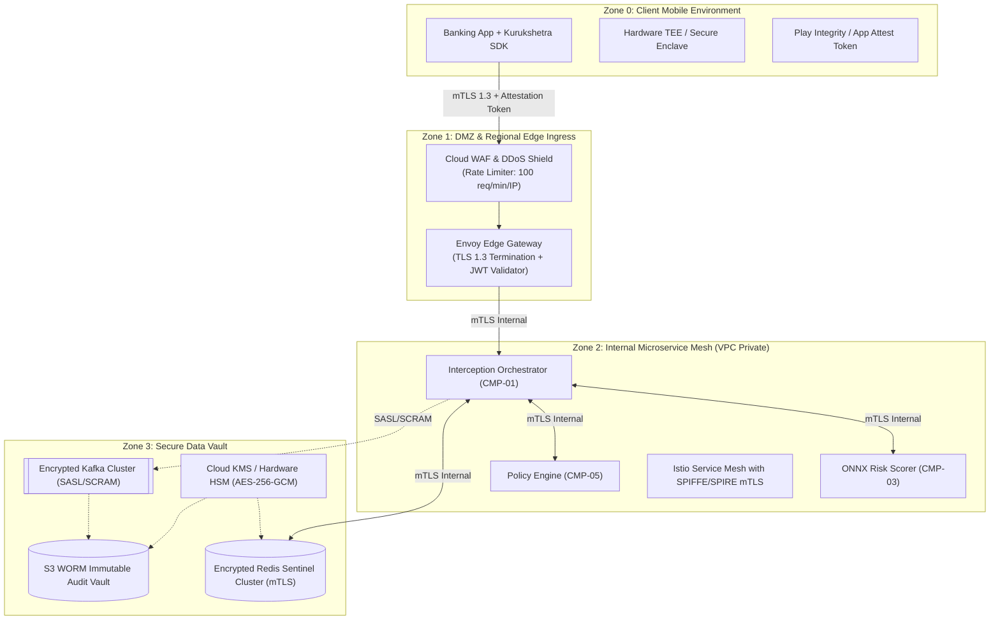

# Security Architecture & Threat Modeling Specification

## 1. Security Architecture Principles

Operating directly within the real-time financial transaction path makes Kurukshetra an exceptionally high-value target for both organized cybercrime syndicates and nation-state threat actors. 

The security architecture enforces five non-negotiable architectural mandates:
1. **Zero Trust Network Architecture (ZTNA)**: Mutual TLS 1.3 (mTLS) with short-lived X.509 client certificates across all inter-service communications.
2. **Cryptographic Device Attestation**: Verification of hardware-backed mobile app integrity via Google Play Integrity API and Apple DeviceCheck / App Attest.
3. **Defense in Depth**: Layered containment across client, edge gateway, microservice mesh, and data plane.
4. **Least Privilege Role-Based Access Control (RBAC)**: Fine-grained, cryptographically attested permissions for all operational and analyst identities.
5. **Tamper-Evident Non-Repudiation**: Merkle-tree rooted WORM audit logs with SHA-256 digital signatures on all policy decisions.

---

## 2. Threat Modeling: STRIDE Matrix & Mitigations

Kurukshetra's attack surface has been systematically modeled using the Microsoft STRIDE methodology:

| STRIDE Category | Threat Description | Attack Vector | Architectural Mitigation | Residual Risk |
| :--- | :--- | :--- | :--- | :--- |
| **Spoofing** | Malicious actor spoofs mobile client SDK to send fake benign telemetry (faking absence of phone call or remote access tool). | Reverse-engineered APK running in modified emulator. | **Hardware Attestation**: Google Play Integrity API + App Attest hardware tokens. Payloads signed with device key resident in Secure Enclave / Android Keystore. | Compromised zero-day OS kernel running on rooted device. Mitigated by outright blocking rooted devices. |
| **Tampering** | Interception or modification of the Action Directive (`INTERVENE_COACH` changed to `ALLOW`). | Man-in-the-middle (MITM) proxy or local device memory patching (Frida / Xposed). | **mTLS 1.3 + Certificate Pinning**: Pinning public key hashes in native C++ SDK library; HMAC-SHA256 signature on all verdict payloads verified by SDK before execution. | Local runtime memory tampering. Mitigated by native anti-debugging checks. |
| **Repudiation** | Scammed victim or dishonest mule claims the bank never warned them or that the system failed to intervene. | Legal dispute or ombudsman complaint. | **Immutable WORM Audit Logs**: Full `EvidenceDossier` hashed and stored in AWS S3 Glacier Object Lock Compliance Mode with cryptographic timestamps. | None. Cryptographically indisputable. |
| **Information Disclosure** | Leakage of customer PII, account balances, or behavioral biometric data. | Compromised log aggregator or internal rogue developer. | **Strict Tokenization & Ephemeral Buffering**: Raw touch coordinates and phone numbers never hit disk; stored in volatile RAM; accounts pseudonymized via salted SHA-256 hashes. | Insider access with root DB keys. Mitigated by dual-custody KMS key access. |
| **Denial of Service** | Volumetric SYN flood or high-frequency API calls aimed at exceeding the 50ms timeout to force fail-open clearance. | Botnet hammering `/v1/intercept` endpoint. | **Edge Rate Limiting & Token Buckets**: Cloudflare Magic Transit + Envoy token-bucket limiter (100 req/min/IP). If backend degrades, fallback activates selective step-up authentication. | Massive terabit DDoS targeting upstream ISP infrastructure. |
| **Elevation of Privilege** | Fraud analyst modifies decision policy or unfreezes high-risk accounts without approval. | Compromised SOC analyst credentials. | **Two-Person Rule (Dual-Authorization RBAC)**: High-risk account releases and policy modifications require independent digital signatures from two distinct compliance officers. | Collusion between two authorized compliance officers. Mitigated by executive forensic audits. |

---

## 3. Cryptographic Key Management & Data Protection

### 3.1 Data at Rest Encryption
- All databases (Redis, ClickHouse, Kafka, S3) are encrypted at rest using **AES-256-GCM**.
- Master encryption keys are hosted in FIPS 140-2 Level 3 compliant Hardware Security Modules (AWS KMS / Cloud HSM) with mandatory annual key rotation.

### 3.2 Data in Transit Encryption
- External Client Ingress: TLS 1.3 with mandatory cipher suites:
  - `TLS_AES_256_GCM_SHA384`
  - `TLS_CHACHA20_POLY1305_SHA256`
- Internal Service Mesh: Mutual TLS (mTLS) with SPIFFE/SPIRE cryptographic identities rotated every 12 hours.

### 3.3 Zero Raw Biometric Storage
To eliminate compliance liabilities and prevent biometric identity theft, **raw touch coordinates and keystroke timings are never persisted**. Raw sensor events are converted into normalized scalar statistics (`touch_entropy_variance`, `keystroke_dwell_jitter`) inside transient memory buffers, and raw buffers are zeroized (`memset(0)`) immediately upon feature extraction.

---

## 4. Role-Based Access Control (RBAC) Matrix

| Identity Role | Query Risk Score | View Unmasked PII | View Raw SHAP Evidence | Release Transaction Hold | Deploy New Policy |
| :--- | :---: | :---: | :---: | :---: | :---: |
| **Mobile Client App** | No | Self Only | No | No | No |
| **Core Payment Switch** | Read-Only | System Token | No | No | No |
| **Tier-1 SOC Analyst** | Read-Only | Masked | Read-Only | Escalate Only | No |
| **Tier-2 Senior Fraud Lead** | Read-Only | Full Access | Full Access | Single Sign ($\le \$5\text{k}$) | No |
| **Chief Compliance Officer** | Read-Only | Full Access | Full Access | Dual Sign ($> \$5\text{k}$) | Dual Sign Required |
| **MLOps / Platform Admin** | Metrics Only | No Access | No Access | No | Staging Only |

---

## 5. Security Verification & Penetration Testing Protocols

1. **Static & Dynamic Analysis (SAST/DAST)**: Continuous scanning of all Go and Python code repositories via Semgrep and SonarQube with zero allowed Critical/High vulnerabilities.
2. **Adversarial Red-Teaming**: Scheduled bi-annual penetration tests by independent financial cybersecurity specialists targeting APK reverse engineering, certificate unpinning, and adversarial ML evasion.
