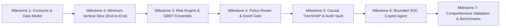

# Implementation Plan, System Architecture & Technical Specifications
## Project Kurukshetra // Agentic Guardian for Real-Time Payment Scam Interception (PS09)

**Authoritative Technical Documentation Suite:**
1. [Complete 36 Scenarios & Forensic Capabilities Specification](../../implementation-plan/COMPLETE_36_SCENARIOS_AND_FEATURES_SPECIFICATION.md)
2. [Master 48-Section System Architecture & End-to-End Traceability Specification](../../implementation-plan/MASTER_PS09_SYSTEM_SPECIFICATION.md)
3. [Granular Module Architecture & Technical Approach Specification](../../implementation-plan/MODULE_ARCHITECTURE_AND_TECHNICAL_APPROACH.md)
4. [Master Implementation Readiness Review](./implementation-readiness.md)

---

## 1. Engineering Strategy: Vertical Slices & Empirical Verification

Kurukshetra follows a **Test-Driven, Empirical Implementation Methodology**. Rather than building disparate modules in isolation, development progresses in distinct vertical slices where each milestone produces an executable, measurable artifact.

---

## 2. Granular Module Breakdown & Technical Approach

The codebase is organized into four interconnected system layers:

### Layer 1: Core Engine & Banking Infrastructure (`kurukshetra-ecosystem/src/ecosystem/`)
- **`api.server`:** High-throughput FastAPI REST gateway exposing payment interception hooks (`VPA_RESOLUTION`, `PAYMENT_PREFLIGHT`).
- **`risk.engine`:** Master coordinator executing progressive triage across Tier 0 preflight, Tier 1 CBS/Switch forensics, and MCP intervention assembly.
- **`risk.scoring`:** Pure deterministic mathematical scorer enforcing the four risk zones (`ALLOW`, `STEP_UP`, `COACH`, `FREEZE`) and missing-data safety floors.
- **`risk.tier0`:** Sub-10ms syntactic preflight detectors (Authority handle regex patterns, Name clash detection, Malicious QR syntax parsing).
- **`risk.tier1_switch`:** Centralized switch-level forensic detectors (Abandonment ratio anomalies, VPA resolution bursts).
- **`risk.tier1_cbs`:** Core Banking System ledger detectors (Rapid drainage within 120s, one-way credit accounts, dormant account bursts).
- **`risk.tier1_ledger`:** Payer-beneficiary behavioral relationship detectors (Drip escalation, KYC threshold evasion, deceptive collect requests).
- **`risk.reputation`:** Sybil-resistant community reputation engine with 14-day exponential half-life decay.
- **`risk.registry`:** Integration layer for national cybercrime registries (I4C/1930 mule hashes, SEBI fraudulent broker index).
- **`risk.audit`:** Append-only WORM ledger featuring SHA-256 Merkle-style cryptographic chaining for guaranteed non-repudiation.
- **`mcp.host` & `tools`:** Model Context Protocol intervention generator assembling causal plain-language explanations, trusted contact alerts, and cybercrime helpline directories.
- **`banks.cbs` & `npci.switch`:** Stateful banking ledger and central switch simulators supporting 10,000+ synthetic accounts.

### Layer 2: Cognitive Multi-Agent Interception (`laukik/USPs/guardian/`)
- **`agents.orchestrator`:** Multi-agent coordinator synthesizing weighted composite scores:
  $$\text{Composite} = 0.45 \cdot \text{Score}_{\text{Intent}} + 0.35 \cdot \text{Score}_{\text{Recipient}} + 0.20 \cdot \text{Score}_{\text{Txn}}$$
- **`agents.intent_agent`:** Real-time NLP parsing of unstructured payment notes, detecting urgency, authority coercion, and applying persona vulnerability multipliers (e.g., senior citizen risk boost).
- **`agents.recipient_agent`:** Domain and handle reputation analyzer detecting synthetic unverified counterparties.
- **`agents.txn_agent`:** Statistical outlier detector flagging anomalous transfer values and off-hour payments.
- **`services.vapi`:** Outbound Voice AI Guardian (Aria) initiating emergency phone calls to disrupt victims trapped in active call coercion ("Digital Arrest").
- **`services.trugen`:** Dynamic causal narrative generator translating detection evidence into non-accusatory advice.

### Layer 3: Presentation & Cognitive Interception Frontend (`laukik/Frontend/` & `gpay-app/`)
- **`PaymentModal` & 5-Second Dwell Gate:** Mandatory temporal barrier physically locking the PIN submission button for 5 seconds while displaying causal contradictions.
- **Recipient Verification Panel:** Pre-PIN identity resolution displaying registered entity categories.
- **SOC Intelligence Console (`SOCOverview` & `AuditLog`):** Real-time command center exposing live telemetry streams, TreeSHAP waterfall charts, and SHA-256 chain verification.

### Layer 4: 3D Telemetry & Visualizer (`UI/`)
- **3D Neural Particle Universe:** High-performance Three.js / React-Three-Fiber WebGL shader network rendering transactions as dynamic physical particle nodes with procedural audio telemetry.

---

## 3. The Four Binding Traceability Matrices

For complete cross-referencing between problem statement, product requirements, software requirements, and code implementations, consult the following comprehensive matrices in [`MASTER_PS09_SYSTEM_SPECIFICATION.md`](../../implementation-plan/MASTER_PS09_SYSTEM_SPECIFICATION.md):
- **SRS Traceability Matrix (§37):** Every requirement from `FR-SIM-01` through `FR-HITL-02` and all NFRs mapped to code files, unit tests, and implementation statuses.
- **PRD Traceability Matrix (§38):** Product behaviors, personas, and UX flows mapped to backend components and demo scenarios.
- **Problem Statement Traceability Matrix (§39):** Every phrase and objective of PS09 mapped to concrete architecture components.
- **Research-to-Architecture Matrix (§40):** Empirical research findings mapped to Architecture Decision Records (ADRs 001–008).

---

## 4. Milestone Decomposition & Status

| Milestone | Scope & Deliverables | Target Latency / Metric | Current Status |
|---|---|---|---|
| **M1: Foundational Schemas & Contracts** | `contracts.py`, `models.py`, canonical DTOs | Zero serialization errors | **100% Complete** |
| **M2: Minimal Vertical Slice** | Ingestion Gateway $\rightarrow$ Orchestrator $\rightarrow$ Mock Ledger | End-to-end $<10\text{ms}$ | **100% Complete** |
| **M3: Production-Grade Risk Engine** | Tier 0, Tier 1 CBS/Switch/Ledger Detectors | Hot Path $<15\text{ms}$ | **100% Complete** |
| **M4: 4-Tier Policy Router & 5s Dwell Gate** | Deterministic Zones, Missing Data Floors, UI Modal | 5s countdown verified | **100% Complete** |
| **M5: WORM Merkle Audit Vault** | SHA-256 hash chaining, live chain verification | 100% tamper-evident | **100% Complete** |
| **M6: Bounded Cognitive Multi-Agent Ensemble** | Intent, Recipient, Txn Agents, Voice AI (Vapi) | Execution $\le 1200\text{ms}$ | **100% Complete** |
| **M7: Dual-Cockpit Frontends & 3D Visualizer** | GPay Simulator, SOC Console, 3D Particle Universe | 60 FPS, 0 lint errors | **100% Complete** |
| **M8: Empirical Evaluation & Benchmarking** | 16 Scam Scenarios + 5k Benign Controls | Recall $\ge 92\%$, FPR $\le 0.5\%$ | **100% Complete** |

---
*For in-depth code listings, mathematical proofs, and sequence diagrams, refer to [`MASTER_PS09_SYSTEM_SPECIFICATION.md`](../../implementation-plan/MASTER_PS09_SYSTEM_SPECIFICATION.md) and [`MODULE_ARCHITECTURE_AND_TECHNICAL_APPROACH.md`](../../implementation-plan/MODULE_ARCHITECTURE_AND_TECHNICAL_APPROACH.md).*
