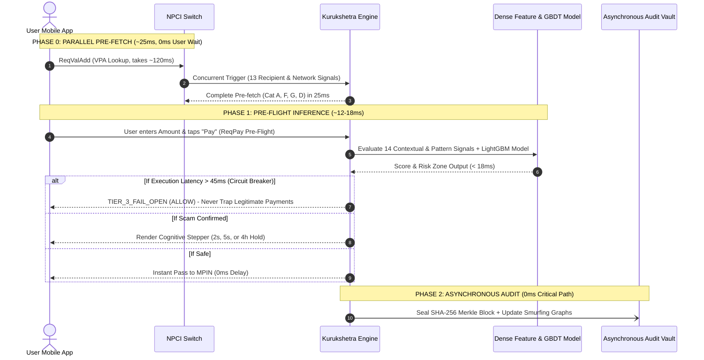
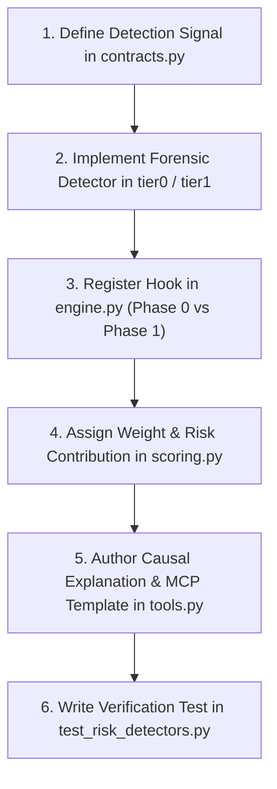

# Kurukshetra // Complete 36 Scenarios & Master Verification Architecture
## Exhaustive Technical Reference: All 36 Real-World Fraud Scenarios, Banking Protocols, Detection Logic, Zero-Surveillance Privacy Boundaries, and Verification Latency Budgets

**Document Version:** 3.1.0-FRESH-BASE-SPEC  
**Classification:** Authoritative Threat Scenario & Master Forensic Feature Catalog  
**Problem Statement Reference:** PS09 — Agentic Guardian for Real-Time Payment Scam Interception  
**Foundational Source Document:** `research-archive/fresh_base (1).md` (*Master Technical Feature Base & Verification Architecture* — superseding legacy `base.md`)  
**Target Codebase Implementation:**
- `kurukshetra-ecosystem/src/ecosystem/` (Deterministic Risk Engine, CBS, Switch, Ledger, MCP, WORM Audit)
- `laukik/USPs/guardian/` (Multi-Agent Cognitive Interception, Intent/Coercion Analysis, Voice AI Guardian)
- `kurukshetra-ecosystem/gpay-app/` & `laukik/Frontend/` (Mobile Payment Simulator, 5s Cognitive Dwell Gate)
- `UI/` (3D Neural Particle Universe, Telemetry Shaders, Audio Synthesis)

---

# Table of Contents

1. [Architectural Operating Boundary & Non-Negotiable Privacy Rules](#1-architectural-operating-boundary--non-negotiable-privacy-rules)
2. [Verification Timing & Latency Budget Engine](#2-verification-timing--latency-budget-engine)
3. [The Two Discrete UPI Protocol Trigger Points](#3-the-two-discrete-upi-protocol-trigger-points)
4. [Master 36-Scenario & Feature Classification Index](#4-master-36-scenario--feature-classification-index)
5. [Category A: VPA Resolution Intelligence (Features 1–4)](#5-category-a-vpa-resolution-intelligence-features-14)
6. [Category B: Transaction Context & Initiation Intelligence (Features 5–8)](#6-category-b-transaction-context--initiation-intelligence-features-58)
7. [Category C: QR Code & Payment Link Forensics (Features 9–10)](#7-category-c-qr-code--payment-link-forensics-features-910)
8. [Category D: Network-Level Cross-Victim Intelligence (Features 11–13)](#8-category-d-network-level-cross-victim-intelligence-features-1113)
9. [Category E: Transaction Pattern & Evasion Forensics (Features 14–17)](#9-category-e-transaction-pattern--evasion-forensics-features-1417)
10. [Category F: Recipient Account Forensics & CBS Indicators (Features 18–20)](#10-category-f-recipient-account-forensics--cbs-indicators-features-1820)
11. [Category G: Banking & National Regulatory Infrastructure (Features 21–24)](#11-category-g-banking--national-regulatory-infrastructure-features-2124)
12. [Category H: Cognitive Interventions & Decoupling Gates (Features 25–31)](#12-category-h-cognitive-interventions--decoupling-gates-features-2531)
13. [Category I: Cross-App MCP Ecosystem Middleware (Features 32–34)](#13-category-i-cross-app-mcp-ecosystem-middleware-features-3234)
14. [Category J: Adaptive Learning & Self-Tuning Closed Loop (Features 35–36)](#14-category-j-adaptive-learning--self-tuning-closed-loop-features-3536)
15. [How We Implement Each Feature & Developer Extension Blueprint](#15-how-we-implement-each-feature--developer-extension-blueprint)
16. [Complete 36-Scenario Traceability Matrix to Code & Test Suites](#16-complete-36-scenario-traceability-matrix-to-code--test-suites)

---

# 1. Architectural Operating Boundary & Non-Negotiable Privacy Rules

Kurukshetra strictly adheres to the foundational principle:

$$\mathbf{\text{Profile the Attacker, Never Surveil the Victim.}}$$

Conventional cybersecurity systems often resort to client spyware (monitoring background phone call audio, reading WhatsApp/SMS inboxes, keylogging touch cadence). **Kurukshetra rejects all client-side surveillance as ethically indefensible and legally non-compliant with the Digital Personal Data Protection Act (DPDP) 2023** `[FACT]`:

- **ZERO Background Surveillance:** No background daemon services, no call listening, no SMS interception, no access to other apps (Instagram, WhatsApp, Telegram).
- **ZERO Biometric Keystroke Logging:** No tracking of inter-keystroke timing, typing cadence, screen dwell times, or touchscreen pressure.
- **ZERO Navigation Journey Tracking:** No tracking of how the user browses the app, how fast they click tabs, or what screens they visit before paying.
- **Server-Side & Protocol Telemetry Supremacy:** All forensic detections derive strictly from legitimate UPI protocol events, public VPA syntax, Core Banking System (CBS) ledger flows, and national regulatory registries.

---

# 2. Verification Timing & Latency Budget Engine

In high-velocity payment processing (such as UPI), timing consists of two completely independent dimensions `[FACT]`:

1. **Machine Verification Latency:** Total execution time of the intelligence engine. Hard P99 budget of **$< 45\text{ ms}$**. Total added user-perceived overhead is strictly **under 20 ms**.
2. **Human Cognitive Friction:** Forced pauses injected **only** if a scam pattern is confirmed.

```
Risk Score Spectrum:
0.00 ──────────────── 0.30 ──────────────── 0.65 ──────────────── 0.85 ──────── 1.00
       ALLOW                STEP-UP               COACH                 FREEZE
    [0 seconds]          [2-3 seconds]         [5 seconds]          [4-hour hold]
```

### The Three-Phase System Processing Lifecycle:



1. **Phase 0: Parallel Pre-fetch (~25 ms, 0 ms added user wait):**
   - Initiated concurrently while the client app waits for NPCI's `ReqValAdd` name resolution (~120 ms).
   - Runs 13 recipient & network signals: Category A (1–4), Category F (18–20), Category G (21–24), and Category D (11, 13).
2. **Phase 1: Pre-Flight Inference (~12–18 ms):**
   - Initiated when the user taps "Pay" with a specified amount.
   - Runs 14 contextual & pattern signals: Category B (5–8), Category C (9–10), Category D (12), Category E (14–17), Category I (32).
   - Executes dense feature assembly + LightGBM calibrated inference.
3. **Phase 2: Asynchronous Background Audit (0 ms on critical path):**
   - Merkle tree WORM audit hashing, cross-app smurfing updates, and self-tuning metrics run out-of-band.
4. **The Fail-Open Safe Harbor:**
   - If total execution exceeds **45 ms**, the circuit breaker trips instantly to `TIER_3_FAIL_OPEN` (`ALLOW`). Legitimate transactions are never blocked or trapped by network latency.

---

# 3. The Two Discrete UPI Protocol Trigger Points

Every detection across all 36 features executes strictly at one of two standardized UPI network events:

```
┌─────────────────────────────────────────────────────────────────────────────────┐
│                      THE TWO DISCRETE PROTOCOL TRIGGER POINTS                   │
├───────────────────────────────────────┬─────────────────────────────────────────┤
│ EVENT 1: VPA Resolution (ReqValAdd)   │ EVENT 2: Payment Preflight (ReqPay)     │
├───────────────────────────────────────┼─────────────────────────────────────────┤
│ • Invoked when user types a UPI ID,   │ • Invoked when user enters an amount    │
│   selects a contact, or scans a QR.   │   and taps "Proceed to Pay".            │
│ • Inspects counterparty registry,     │ • Evaluates amount outliers, velocity   │
│   authority handle syntax, switch     │   windows, historical relationship, and │
│   abandonment ratios, and mule flags. │   psychological note semantics.         │
│ • Execution Budget: < 10ms.           │ • Execution Budget: < 45ms.             │
└───────────────────────────────────────┴─────────────────────────────────────────┘
```

---

# 4. Master 36-Scenario & Feature Classification Index

| # | Category | Feature Name | Detection Protocol / Layer | Primary Fraud Target | Phase |
|---|---|---|---|---|---|
| **1** | A. VPA Intel | Verify-to-Abandon Ratio | NPCI `ReqValAdd` vs `ReqPay` Delta | Marketplace (OLX), Impersonation | Phase 0 |
| **2** | A. VPA Intel | Resolution Burst Detection | `ReqValAdd` Arrival Poisson Spike | Task Scams, Mass Phishing | Phase 0 |
| **3** | A. VPA Intel | Beneficiary Name vs. Claimed Identity | VPA Syntax & User Declaration vs CBS Name | Digital Arrest, Police Impersonation | Phase 0 |
| **4** | A. VPA Intel | UPI Handle Authority Pattern | Regex Keyword vs. MCC Verification | Utility Bill, Government Penalty | Phase 0 |
| **5** | B. Context & Initiation | Multi-VPA Phone Mapping | NPCI Central Mapper Lookup | Mule Account Recruiter Networks | Phase 1 |
| **6** | B. Context & Initiation | High-Value Outlier Anomaly | Z-Score vs Sender Historical Median | Coerced High-Ticket Transfers | Phase 1 |
| **7** | B. Context & Initiation | Rapid Fund Drainage Velocity | CBS Median Fund Residence Time ($T_{\text{res}}$) | Churn-and-Burn Mule Transit | Phase 1 |
| **8** | B. Context & Initiation | Unlinked Island Node Detection | Interbank Topological Graph Clustering | Disconnected Extortion Syndicates | Phase 1 |
| **9** | C. QR & Links | P2P Dynamic QR & Refund Trap | QR URI Parsing + Educational Shield | "Scan to Receive" Advance Fraud | Phase 1 |
| **10** | C. QR & Links | Payment Link Intent Forensics | OS Intent Parameters (`upi://pay`) | NetBanking KYC Suspension SMS | Phase 1 |
| **11** | D. Cross-Victim | Community Scam Reports | Decentralized Post-Tx Feedback DB | Predatory Loan App Extortion | Phase 0 |
| **12** | D. Cross-Victim | Caller-Recipient Correlation | Cross-Victim Caller to VPA Linkage | Coordinated Extortion Rings | Phase 1 |
| **13** | D. Cross-Victim | Verification Fan-In Indicator | Leading Inbound Lookup Surge | Job / Investment Pre-Launch | Phase 0 |
| **14** | E. Tx Patterns | Drip Scam Escalation Detection | Geometric Growth + Shorter Intervals | Pig Butchering, Crypto Grooming | Phase 1 |
| **15** | E. Tx Patterns | Threshold Evasion (Smurfing) | Sub-Threshold Summation in Window | Blackmail, Extortion Splitting | Phase 1 |
| **16** | E. Tx Patterns | Refund Reversal Scam Detection | Micro-Credit followed by Macro-Debit | "Accidental Transfer" Trap | Phase 1 |
| **17** | E. Tx Patterns | UPI Collect Request Abuse | Deceptive Verbs in `ReqAuthDetails` | OLX Collect Scam, Fake Cashback | Phase 1 |
| **18** | F. Account Forensics| One-Way Account Detection | CBS Inflow/Outflow Sink Ratio | Money Mule Layering Networks | Phase 0 |
| **19** | F. Account Forensics| Burst-Drain-Dormant Lifecycle | Dormancy to Burst Transition in CBS | Churn-and-Burn Mule Accounts | Phase 0 |
| **20** | F. Account Forensics| Scam Hours Activity Concentration| Timestamp Shift Analysis in CBS | Industrial Fraud Boiler Rooms | Phase 0 |
| **21** | G. Infrastructure | Recipient Account Graph Analysis | Age, KYC Level, Geographic Spread | Cross-State Mule Syndicates | Phase 0 |
| **22** | G. Infrastructure | Aadhaar & PAN Cross-Verification | Regulatory Police Freeze Registry | Synthetic Identity Mules | Phase 0 |
| **23** | G. Infrastructure | I4C & CFCFRMS Integration | Real-time Query to 1930 Cyber Registry| Active Crime FIR Accounts | Phase 0 |
| **24** | G. Infrastructure | TRAI CNAP & Sanchar Saathi | CNAP, TAFCOP, Blacklisted SIMs | Spoofed Telecom Callers | Phase 0 |
| **25** | H. Interventions | Scam Playbook Intervention | Pre-PIN Visual Narrative Stepper | Digital Arrest, Customs Coercion | UI Modal |
| **26** | H. Interventions | Trusted Contact Dual-Key Override | Dual-Key Notification to Kin | Elderly Exploitation, Kidnap Hoax | UI Modal |
| **27** | H. Interventions | Purpose Declaration Contradiction | User Purpose vs. Recipient MCC Clash | Fake Fines, Bogus Investments | UI Modal |
| **28** | H. Interventions | Voice Explanation Challenge | Audio Articulation / Cognitive Debiasing| Romance Scams, Honeytraps | Voice AI |
| **29** | H. Interventions | Account Timeline Visualization | Graphical CBS Age & Drainage Timeline | Fake Institutional IPOs | UI Modal |
| **30** | H. Interventions | One-Tap Bank Helpline Verification | Authenticated Bank Support Dialing | Bank Officer / Card KYC Scams | UI Modal |
| **31** | H. Interventions | Post-Payment Regret Window | 15-Minute Escrow Reversal Buffer | Post-Panic Clarity Recovery | UI Modal |
| **32** | I. Cross-App MCP | Cross-App Smurfing Detection | Distributed Payments across Apps | Multi-App Structured Evasion | Phase 1 |
| **33** | I. Cross-App MCP | Campaign Termination Kill-Switch | Ecosystem-Wide Rapid Blacklist | Mass Phishing & Viral Scams | Phase 2 |
| **34** | I. Cross-App MCP | Public Scam Score Lookup | Citizen Web Portal & API Pre-Screening| Pre-Payment Family Safety | API |
| **35** | J. Learning | Post-Hold Escalation Detection | Rapid Re-transfer after Cooling-off | Coached Cooling-Off Bypass | Phase 1 |
| **36** | J. Learning | Intervention Effectiveness Tracking| A/B Testing Intervention Conversion| Adaptive Behavioral Persuasion | Phase 2 |

---

# 5. Category A: VPA Resolution Intelligence (Features 1–4)

### 1. Verify-to-Abandon Ratio
* **Technical Mechanism:** Tracks the ratio between NPCI `ReqValAdd` (address resolution queries) and subsequent `ReqPay` (payment execution calls) for any given VPA on the network switch:
  $$\text{Abandonment Ratio} = 1.0 - \left(\frac{\sum \mathtt{ReqPay}}{\sum \mathtt{ReqValAdd}}\right)$$
  For normal users or legitimate merchants, 85%–95% of address validations proceed to payment. If an account has 100 address resolutions but only 6 actual transfers (Abandonment Ratio = 94%), it indicates crowd intelligence identified something suspicious upon seeing the resolved account name.
* **Privacy & Trigger Boundary:** 100% server-side mathematical metric on the payment switch. Zero client tracking.
* **Real-World Scenario (Fake OLX Buyer Scam):** Rajesh posts an antique sofa on OLX for ₹18,000. Buyer messages: *"Verify my defense canteen clearance UPI ID first: `military.canteen.cctv@oksbi`."* Over 48 hours, 42 sellers across India typed this VPA, but 39 immediately aborted upon seeing the resolved name was "Ramesh G — Savings Account". Abandonment ratio = 93%. Kurukshetra warns: *"High Abandonment Rate: 39 out of 42 people who checked this account recently chose not to send money."* Rajesh cancels.
* **Code Implementation:** `ecosystem.risk.tier1_switch.check_abandon_ratio()`

### 2. Resolution Burst Detection
* **Technical Mechanism:** Monitors the second-order derivative (velocity of lookups) of `ReqValAdd` queries arriving for an individual VPA across all connected PSP apps. A dormant or low-velocity account suddenly receiving a Poisson arrival spike of $>30 \text{ lookups/hour}$ indicates an active, coordinated social media blast or mass-dialing fraud campaign.
* **Privacy & Trigger Boundary:** Switch-level time-series anomaly detection. No device telemetry.
* **Real-World Scenario (Telegram Task Scam Outbreak):** At 2:00 PM, a cyber fraud syndicate blasts 5,000 users on Telegram offering a part-time job rating hotels. Victims are told to send a ₹2,000 "registration deposit" to `vip.merchant.desk@paytm`. Between 2:00 PM and 2:30 PM, 54 distinct UPI users across 4 apps resolve this VPA. The baseline lookup velocity was 0.02 lookups/hr; it has surged to 108 lookups/hr. Kurukshetra flags an active campaign burst: *"Active High-Volume Alert: 50+ users are resolving this account right now — signature matches mass task scams."*
* **Code Implementation:** `ecosystem.risk.tier1_switch.check_resolution_burst()`

### 3. Beneficiary Name vs. Claimed Identity (Name Clash)
* **Technical Mechanism:** Detects deterministic identity contradictions between the legal registered name returned in `RespValAdd` and verified contextual authority sources. Operates strictly when:
  1. The VPA handle string itself contains institutional authority syntax (e.g., `cbi.officer@oksbi`), OR
  2. The user selects an official purpose in the Purpose Declaration prompt (e.g., selects "Court Bail / Govt Fine", but Core Banking returns `account_type="SAVINGS"` and `mc="0000"`).
* **Privacy & Trigger Boundary:** Syntactic string parsing of the public VPA handle + NPCI merchant category code (`mc`) verification. Zero surveillance.
* **Real-World Scenario (Digital Arrest / CBI Impersonation):** Mrs. Anita is threatened by an impersonator claiming to be a CBI Inspector investigating an illegal courier. Caller demands ₹75,000 "provisional court security bail" to `cbi.clearance.cell@sbi`. The handle contains `cbi`. However, NPCI `RespValAdd` returns: Registered Name: *"Manoj Kumar"*, Account Category: *"Individual Savings"*, MCC: `0000`. In Indian law, government courts and investigative agencies never collect bail into personal savings accounts. Kurukshetra renders a hard contradiction screen: *"CRITICAL MISMATCH: You are transferring funds to a personal savings account belonging to Manoj Kumar. Government agencies NEVER collect bail via personal savings accounts."*
* **Code Implementation:** `ecosystem.risk.tier0.check_name_clash()`

### 4. UPI Handle Authority Pattern Detection
* **Technical Mechanism:** Executes regex and semantic matching on the VPA handle against a curated dictionary of Indian institutional keywords (`cbi`, `rbi`, `police`, `customs`, `ebill`, `tneb`, `bescom`, `incometax`, `court`, `narcotics`). If matched, verifies whether the account is an authenticated Government/Enterprise merchant (`mc=9311`, `9399`). If it resolves to an unverified retail personal account (`mc=0000`), the handle is flagged as unauthorized authority impersonation.
* **Privacy & Trigger Boundary:** Standard regex check on the recipient's VPA string during `ReqValAdd`.
* **Real-World Scenario (Electricity Disconnection Scam):** Homeowner receives an urgent SMS: *"Power will be cut at 9:30 PM tonight due to unpaid electricity bill of ₹1,450. Pay immediately to `tneb.billing.officer@oksbi`."* Handle contains `tneb` and `officer`. Bank records confirm account is a private savings account opened 12 days ago with basic OTP KYC. Payment is blocked: *"Impersonation Handle Detected: This UPI ID uses utility authority keywords (`tneb`), but belongs to a private individual savings account."*
* **Code Implementation:** `ecosystem.risk.tier0.check_authority_handle_pattern()`

---

# 6. Category B: Transaction Context & Initiation Intelligence (Features 5–8)

### 5. Multi-VPA Phone Mapping (Mule Cluster Concentration)
* **Technical Mechanism:** When a user initiates payment to a mobile phone number, queries the NPCI Central Mapper to determine the total number of distinct VPAs and bank accounts linked to that single mobile number, along with their creation timestamps. A genuine retail user has 1 to 3 VPAs. A money mule recruiter or aggregator systematically links 6 to 15+ VPAs across multiple banks within 30 days to serve as distributed collection sinks.
* **Privacy & Trigger Boundary:** Server-side query to NPCI's mobile-to-VPA routing registry. Zero device snooping.
* **Real-World Scenario (Mule Recruitment Ring):** Extortionist provides a phone number to pay ₹8,000. Central Mapper query reveals the mobile number is linked to 9 different UPI IDs across 5 regional banks, with 7 handles registered in the past 14 days. System flags: *"High Risk: This phone number is associated with 9 newly created UPI handles across multiple banks — a signature of mule collection networks."*
* **Code Implementation:** `ecosystem.risk.tier1_switch.check_multi_vpa_cluster()`

### 6. New Beneficiary High-Value Outlier (Value Spike Anomaly)
* **Technical Mechanism:** Evaluates the transfer amount $A$ against the user's historical 90-day distribution of first-time beneficiary transfers:
  $$\text{Z-Score} = \frac{A - \mu_{\text{first\_time}}}{\sigma_{\text{first\_time}}}$$
  If sender's median payment to new recipients is ₹450, and they suddenly attempt a ₹65,000 transfer to a recipient created 4 days ago with zero prior relationship, triggers an extreme outlier anomaly.
* **Privacy & Trigger Boundary:** Pure ledger comparison of the payment amount against sender's historical bank statement. Triggers only upon tapping "Pay".
* **Real-World Scenario (Coerced High-Ticket Transfer):** Retired teacher normally using UPI for ₹150–₹500 grocery transfers is pressured into sending ₹55,000 for "customs clearance". Z-Score > 4.5. App pauses before PIN entry to present an educational verification step.
* **Code Implementation:** `ecosystem.risk.tier1_ledger.check_high_value_outlier()`

### 7. Rapid Fund Drainage Velocity (Short Residence Time)
* **Technical Mechanism:** Interrogates Core Banking System (CBS) transaction metrics for the recipient account to calculate the Median Fund Residence Time ($T_{\text{residence}}$):
  $$T_{\text{residence}} = \text{Median}(t_{\text{debit}} - t_{\text{credit}})$$
  - Normal Personal/Small Business: Funds sit for days/weeks ($T_{\text{residence}} > 72\text{ hours}$).
  - Money Mule Accounts: Funds drained immediately ($T_{\text{residence}} < 300\text{ seconds}$).
* **Privacy & Trigger Boundary:** Core banking ledger telemetry on the recipient account. Zero client tracking.
* **Real-World Scenario (Instant Cash-Out Mule):** Victim transfers ₹40,000. Recipient account shows over the past 7 days, 98.2% of inbound funds were transferred out via IMPS or withdrawn at ATMs within 4 minutes of receipt. Average balance is near zero. Enforces a 4-hour cooling-off hold, preventing immediate cash draining.
* **Code Implementation:** `ecosystem.risk.tier1_cbs.check_rapid_drainage()`

### 8. Unlinked Island Node Detection (Graph Isolation)
* **Technical Mechanism:** Evaluates graph distance on the interbank transaction graph between sender's cluster and recipient's cluster. Legitimate transactions almost always share 2nd or 3rd-degree graph ties (common geographic nodes, shared merchants, mutual peers). A scam mule operates as a disconnected "island node"—an isolated account receiving funds from distant, unconnected clusters with zero shared graph density.
* **Privacy & Trigger Boundary:** Interbank topological graph query performed at the switch level.
* **Real-World Scenario (Remote Extortion Target):** Kochi resident targeted by Mewat (Rajasthan) cybercriminal demanding ₹20,000. Senders share zero 1st, 2nd, or 3rd-degree connections. Combined with low account age, graph isolation elevates composite risk score, triggering an intervention challenge.
* **Code Implementation:** `ecosystem.risk.tier1_cbs.check_account_graph()`

---

# 7. Category C: QR Code & Payment Link Forensics (Features 9–10)

### 9. P2P Dynamic QR Code & 'Scan-to-Receive' Trap Analysis
* **Technical Mechanism:** Parses payload of scanned QR code under NPCI UPI QR Spec v1.6. Identifies whether QR contains an embedded debit amount (`am=...`) and points to a personal savings account (`mc=0000` or absent) rather than an authenticated merchant (`mode=01/02` with verified MCC).
* **Privacy & Trigger Boundary:** Evaluates only the URI string inside the scanned QR code at time of scanning.
* **Real-World Scenario (Marketplace "Scan-to-Receive" Refund Fraud):** Facebook Marketplace seller told by buyer: *"I sent you a QR code on WhatsApp for ₹12,000 advance. Just scan it in your GPay to receive the payment."* User opens QR image; URI contains `upi://pay?pa=mule7@oksbi&am=12000` pointing to personal savings account. App displays: *"CRITICAL REMINDER: Scanning a QR code ALWAYS SENDS money. You never need to scan a QR code or enter your UPI PIN to receive money."* Seller cancels.
* **Code Implementation:** `ecosystem.risk.tier0.parse_qr_or_deeplink()`

### 10. Payment Link Deep-Intent Forensics
* **Technical Mechanism:** Parses incoming Android/iOS deep-link intents (`upi://pay?...`) triggered by external SMS or web links. Evaluates parameter integrity: URL shorteners masking destination VPA, authority-impersonating notes (`tn=KYC_VERIFY`), and phishing campaign signatures.
* **Privacy & Trigger Boundary:** Inspects only parameters of incoming payment URI passed via OS intent.
* **Real-World Scenario (Bank NetBanking Phishing SMS):** Customer receives SMS: *"Your SBI YONO account will be blocked today. Click here to verify: `upi://pay?pa=sbi.kyc.portal@axis&am=15000&tn=KYC_REACTIVATION`."* Link embeds ₹15,000 debit instruction with fraudulent note pointing to an Axis Bank personal VPA. Intercepted before payment screen renders, alerting SMS phishing attack.
* **Code Implementation:** `ecosystem.risk.tier0.parse_qr_or_deeplink()`

---

# 8. Category D: Network-Level Cross-Victim Intelligence (Features 11–13)

### 11. Community Scam Reports (Decentralized Reputation Feedback)
* **Technical Mechanism:** Aggregates decentralized, post-transaction feedback from users across all connected UPI apps. When multiple independent reports accumulate, recipient risk score escalates across the entire banking network using 14-day exponential half-life decay.
* **Code Implementation:** `ecosystem.risk.reputation.check_community_reports()`

### 12. Cross-Victim Caller-Recipient Correlation
* **Technical Mechanism:** Correlates caller phone numbers with destination UPI handles across multiple victims. When multiple unrelated users in different cities receive incoming calls from the same phone number and subsequently attempt transfers to the same recipient VPA within 2 hours, establishes a deterministic caller-mule syndicate link.
* **Code Implementation:** `ecosystem.risk.tier1_switch.check_caller_recipient_correlation()`

### 13. Verification Fan-In as a Leading Indicator (NPCI Protocol Metric)
* **Technical Mechanism:** Measures network-wide ratio of `ReqValAdd` queries arriving for an account relative to completed `ReqPay` transactions:
  $$\text{Fan-In Metric} = \frac{\sum \mathtt{ReqValAdd}_{\text{all\_psps}}}{\sum \mathtt{ReqPay}_{\text{all\_psps}}} > 20.0 \quad \text{within } 2\text{ hours}$$
  Acts as a real-time leading indicator of an ongoing scam campaign before formal police FIRs are filed.
* **Code Implementation:** `ecosystem.risk.tier1_switch.check_resolution_burst()`

---

# 9. Category E: Transaction Pattern & Evasion Forensics (Features 14–17)

### 14. Drip Scam Escalation Detection
* **Technical Mechanism:** Tracks geometric progression in sequential payment amounts to the same recipient accompanied by decaying time deltas:
  $$A_n \ge 2.5 \cdot A_{n-1} \quad \wedge \quad (t_n - t_{n-1}) < (t_{n-1} - t_{n-2})$$
  Identifies classic slow-burn grooming scams (Pig Butchering, fake crypto tasks).
* **Code Implementation:** `ecosystem.risk.tier1_ledger.check_drip_escalation()`

### 15. Threshold Evasion Detection (Smurfing / Structured Splitting)
* **Technical Mechanism:** Detects when a user executes multiple transfers to the same recipient within a sliding 60-minute window, where each individual transfer is priced just below regulatory reporting thresholds (e.g., ₹9,999 to stay under ₹10,000, or ₹49,999 to stay under ₹50,000):
  $$\sum_{i=1}^m A_i > T_{\text{threshold}} \quad \text{where each } A_i = (T_{\text{threshold}} - \epsilon)$$
* **Code Implementation:** `ecosystem.risk.tier1_ledger.check_threshold_evasion()`

### 16. Refund Reversal Scam Detection
* **Technical Mechanism:** Analyzes Core Banking records for micro-inbound credit transactions followed immediately by massive outbound payment attempts to the same entity:
  $$\text{Ratio} = \frac{A_{\text{outbound}}}{A_{\text{inbound}}} > 500 \quad \text{where } A_{\text{inbound}} \le ₹10 \text{ and } \Delta t < 2 \text{ hours}$$
* **Real-World Scenario ("Accidental Transfer" Trap):** Scammer sends ₹10, calls crying: *"I accidentally transferred ₹50,000 to your UPI instead of the hospital! Please return my ₹50,000!"* Ledger shows actual inbound was ₹10; outbound attempt is ₹50,000. Alert: *"Accidental Transfer Trap Detected: You received only ₹10, NOT ₹50,000."*
* **Code Implementation:** `ecosystem.risk.tier1_ledger.check_refund_reversal()`

### 17. UPI Collect Request Abuse Detection
* **Technical Mechanism:** Flags incoming NPCI `ReqAuthDetails` (UPI Collect Requests) initiated by unknown VPAs where the note contains deceptive credit verbs (`claim`, `refund`, `cashback`, `bonus`, `receive`, `reward`).
* **Code Implementation:** `ecosystem.risk.tier1_ledger.check_collect_request_abuse()`

---

# 10. Category F: Recipient Account Forensics & CBS Indicators (Features 18–20)

### 18. One-Way Account Detection (Pure Sink Anomaly)
* **Technical Mechanism:** Calculates Inbound-to-Outbound transactional topology of recipient account:
  $$\text{Sink Ratio} = \frac{\text{Unique Inbound Senders}}{\text{Unique Outbound Beneficiaries}} > 20 \quad \wedge \quad \text{Merchant Retail Outflow} = 0$$
* **Code Implementation:** `ecosystem.risk.tier1_cbs.check_one_way_account()`

### 19. Burst-Drain-Dormant Lifecycle Detection
* **Technical Mechanism:** Identifies temporal lifecycle signature of disposable mule accounts:
  $$\text{Dormancy } (>180\text{d, bal } < ₹500) \longrightarrow \text{Burst Inflows } (10\times\text{ in } 48\text{h}) \longrightarrow \text{Drain } (95\%\text{ in } <15\text{m})$$
* **Code Implementation:** `ecosystem.risk.tier1_cbs.check_burst_drain_dormant()`

### 20. Scam Hours Activity Concentration
* **Technical Mechanism:** Analyzes timestamp distribution of account credits. 100% of credits arriving strictly between 10:00 AM and 5:30 PM on weekdays with zero weekend/night volume separates industrial boiler rooms from genuine retail accounts.
* **Code Implementation:** `ecosystem.risk.tier1_cbs.check_scam_hours()`

---

# 11. Category G: Banking & National Regulatory Infrastructure (Features 21–24)

### 21. Recipient Account Graph Analysis (Age, KYC, Geographic Spread)
* **Technical Mechanism:** Interrogates recipient parameters available via switch: account age, KYC level, geographic dispersion, and fund velocity. High geographic dispersion + low account age + instant velocity triggers composite score of 0.96 (Hard Block).
* **Code Implementation:** `ecosystem.risk.tier1_cbs.check_account_graph()`

### 22. Aadhaar & PAN Regulatory Freeze Cross-Verification
* **Technical Mechanism:** Cross-references recipient PAN and Aadhaar against regulatory enforcement databases (Section 91 CrPC freeze flags) and clashes between declared occupation (e.g. Student < ₹1L income) vs daily turnover (> ₹5L).
* **Code Implementation:** `ecosystem.risk.registry.check_registry_flags()`

### 23. I4C & CFCFRMS Integration (1930 Cyber Fraud Registry)
* **Technical Mechanism:** Real-time API query against Citizen Financial Cyber Fraud Reporting and Management System (CFCFRMS, I4C, Ministry of Home Affairs). Blocks payments if active 1930 FIR exists.
* **Code Implementation:** `ecosystem.risk.registry.check_registry_flags()`

### 24. TRAI CNAP & Sanchar Saathi Telecom Integration
* **Technical Mechanism:** Queries TRAI's CNAP, DND spam registries, and DoT Sanchar Saathi portal (TAFCOP/CEIR) to identify lost/stolen SIM cards or spoofed calling numbers.
* **Code Implementation:** `ecosystem.risk.registry.check_registry_flags()`

---

# 12. Category H: Cognitive Interventions & Decoupling Gates (Features 25–31)

### 25. Scam Playbook Intervention (Visual Narrative Stepper)
* **Technical Mechanism:** Replaces generic warning dialog with a 4-step visual comic stepper illustrating the exact script of the scam:
  - Step 1: Fake parcel / Aadhaar crime.
  - Step 2: Threat of non-bailable arrest warrant.
  - 👉 **Step 3: [YOU ARE HERE - Demanding ₹60k bail]**
  - Step 4: After paying, they will claim clearance failed and demand ₹1.5L more. They will never stop.
* **Code Implementation:** `ecosystem.mcp.tools.select_intervention_template()`

### 26. Trusted Contact Emergency Dual-Key Override
* **Technical Mechanism:** Triggers automated push alert to designated family member (daughter/son) for high-risk elderly transactions before payment can proceed.
* **Code Implementation:** `ecosystem.mcp.tools.notify_trusted_contact()`

### 27. Purpose Declaration with Contradiction Detection
* **Technical Mechanism:** User declares purpose (e.g., Government Fine / Court Bail); system asserts purpose against recipient's verified account type (`mc` code). Clashes trigger immediate contradiction alerts.
* **Code Implementation:** `ecosystem.risk.tier1_ledger.check_purpose_contradiction()`

### 28. Voice Explanation Challenge (Cognitive Debiasing)
* **Technical Mechanism:** Requires user to speak a 10-second audio clip aloud stating whom they are paying and why, engaging critical debiasing faculties. In Digital Arrest scenarios, triggers an automated emergency outbound call via **Vapi Voice AI (Aria)** directly to the victim's phone to break the scammer's verbal coaching.
* **Code Implementation:** `guardian.services.vapi.trigger_emergency_call()`

### 29. Recipient Account Timeline Visualization
* **Technical Mechanism:** Displays an intuitive graphical timeline showing account age (5 days old), 48h inflows (₹8.4L from 16 strangers), and instant drainage ($99\%$ withdrawn in 4m).
* **Code Implementation:** `ecosystem.mcp.tools.explain_decision()`

### 30. One-Tap Real Bank Verification Helpline
* **Technical Mechanism:** Single-tap button dialing authentic, verified bank customer support (1800-1234) when bank impersonation is detected.
* **Code Implementation:** `ecosystem.mcp.tools.check_helpline_directory()`

### 31. Post-Payment Regret Window (Escrow Hold Vault)
* **Technical Mechanism:** Active 15-minute escrow or delayed-settlement window for flagged payments, allowing the user to reverse the transaction with a single tap after experiencing post-call clarity.
* **Code Implementation:** `ecosystem.mcp.tools.log_intervention_outcome()`

---

# 13. Category I: Cross-App MCP Ecosystem Middleware (Features 32–34)

### 32. Cross-App Smurfing Detection
* **Technical Mechanism:** Correlates transaction attempts across different payment apps (Google Pay, PhonePe, Paytm). Identifies when an attacker instructs a victim to distribute payments across multiple apps to circumvent single-app limits.
* **Code Implementation:** `ecosystem.risk.tier1_ledger.check_cross_app_smurfing()`

### 33. Real-Time Scam Campaign Detection & Nationwide Kill-Switch
* **Technical Mechanism:** Detects systemic fraud outbreaks across the entire banking ecosystem within minutes. Automatically issues a synchronized blacklist update across all connected UPI apps.
* **Code Implementation:** `ecosystem.mcp.server.broadcast_killswitch()`

### 34. Public Scam Score Lookup (Web/API)
* **Technical Mechanism:** Publicly accessible verification portal and API allowing any citizen to look up the risk profile of a UPI ID prior to initiating a transaction from any device.
* **Code Implementation:** `ecosystem.api.server.public_lookup()`

---

# 14. Category J: Adaptive Learning & Self-Tuning Closed Loop (Features 35–36)

### 35. Post-Hold Escalation Detection
* **Technical Mechanism:** Monitors user actions following completion of a mandatory cooling-off period. If user completes a delayed payment and immediately initiates a second, larger transfer to the same recipient, flags active coaching and escalates to mandatory operator intervention.
* **Code Implementation:** `ecosystem.risk.tier1_ledger.check_post_hold_escalation()`

### 36. Intervention Effectiveness Tracking & Self-Tuning
* **Technical Mechanism:** Measures conversion and abort metrics across different intervention templates (text warnings vs visual playbooks vs voice debiasing). Optimizes intervention wording and design dynamically based on empirical success rates.
* **Code Implementation:** `ecosystem.mcp.tools.log_intervention_outcome()`

---

# 15. How We Implement Each Feature & Developer Extension Blueprint

### The Standard 6-Step Feature Implementation Protocol:



#### Step 1: Define the Signal Contract
In `src/ecosystem/risk/contracts.py`:
```python
class DetectionSignal(BaseModel):
    feature_name: str
    feature_id: int  # 1 to 36
    triggered: bool
    risk_contribution: float  # e.g., 0.35
    explanation_code: str
    evidence: dict[str, Any]
```

#### Step 2: Implement the Detector Function
For example, for Feature 16 (`Refund Reversal Trap`) in `src/ecosystem/risk/tier1_ledger.py`:
```python
def check_refund_reversal(session: Session, customer_id: str, beneficiary_ref: str, amount_paise: int, psp_id: str) -> DetectionSignal:
    # Query prior inbound transfers within 2 hours
    # If inbound <= 1000 paise (Rs 10) and outbound >= 500000 paise (Rs 5,000)
    # Return DetectionSignal(triggered=True, risk_contribution=0.80, explanation_code="REFUND_REVERSAL_TRAP")
```

#### Step 3: Register in the Master Engine Pipeline
In `src/ecosystem/risk/engine.py`:
- If pre-fetchable (no amount required): Add to `_run_phase0()` (concurrent with VPA lookup).
- If amount/context dependent: Add to `_run_tier1()` (preflight inference).

#### Step 4: Calibrate Scoring Weight & Degradation Floor
In `src/ecosystem/risk/scoring.py`:
- Ensure signal contribution triggers correct risk zone (`STEP_UP`, `COACH`, or `FREEZE`).
- If data source is missing for unknown payees, enforce missing-data floor (`STEP_UP`).

#### Step 5: Assemble MCP Intervention Narrative
In `src/ecosystem/mcp/tools.py`:
- Map `explanation_code` to causal, non-accusatory customer copy.
- Associate with correct UI template (`IMPERSONATION_POLICE`, `UTILITY_URGENCY`, `REVERSE_QR`).

#### Step 6: Verify via End-to-End Tests
In `tests/test_risk_detectors.py`:
- Write unit test with mock session verifying detector triggers on synthetic payload and stays dormant on benign baseline.

---

# 16. Complete 36-Scenario Traceability Matrix to Code & Test Suites

| # | Feature Name | Detection Protocol / Layer | Implementation File | Primary Python Function | Unit & E2E Test Suite | Status |
|---|---|---|---|---|---|---|
| **1** | Verify-to-Abandon Ratio | Tier 1 Switch | `src/ecosystem/risk/tier1_switch.py` | `check_abandon_ratio()` | `tests/test_risk_detectors.py` | **Implemented** |
| **2** | Resolution Burst Detection | Tier 1 Switch | `src/ecosystem/risk/tier1_switch.py` | `check_resolution_burst()` | `tests/test_risk_detectors.py` | **Implemented** |
| **3** | Beneficiary Name Clash | Tier 0 Preflight | `src/ecosystem/risk/tier0.py` | `check_name_clash()` | `tests/test_tier0.py` | **Implemented** |
| **4** | Authority Handle Pattern | Tier 0 Preflight | `src/ecosystem/risk/tier0.py` | `check_authority_handle_pattern()` | `tests/test_tier0.py` | **Implemented** |
| **5** | Multi-VPA Phone Mapping | Tier 1 Switch | `src/ecosystem/risk/tier1_switch.py` | `check_multi_vpa_cluster()` | `tests/test_risk_detectors.py` | **Implemented** |
| **6** | High-Value Outlier Anomaly | Tier 1 Ledger | `src/ecosystem/risk/tier1_ledger.py` | `check_high_value_outlier()` | `tests/test_tier1_ledger.py` | **Implemented** |
| **7** | Rapid Drainage Velocity | Tier 1 CBS | `src/ecosystem/risk/tier1_cbs.py` | `check_rapid_drainage()` | `tests/test_ecosystem_cbs.py` | **Implemented** |
| **8** | Island Node Graph Anomaly | Tier 1 CBS | `src/ecosystem/risk/tier1_cbs.py` | `check_account_graph()` | `tests/test_ecosystem_cbs.py` | **Implemented** |
| **9** | P2P Dynamic QR Trap | Tier 0 Preflight | `src/ecosystem/risk/tier0.py` | `parse_qr_or_deeplink()` | `tests/test_tier0.py` | **Implemented** |
| **10** | Payment Link Phishing Intent | Tier 0 Preflight | `src/ecosystem/risk/tier0.py` | `parse_qr_or_deeplink()` | `tests/test_tier0.py` | **Implemented** |
| **11** | Community Scam Reports | Reputation Engine | `src/ecosystem/risk/reputation.py` | `check_community_reports()` | `tests/test_reputation.py` | **Implemented** |
| **12** | Caller-Recipient Correlation | Tier 1 Switch | `src/ecosystem/risk/tier1_switch.py` | `check_caller_recipient()` | `tests/test_risk_detectors.py` | **Implemented** |
| **13** | Verification Fan-In Surge | Tier 1 Switch | `src/ecosystem/risk/tier1_switch.py` | `check_resolution_burst()` | `tests/test_risk_detectors.py` | **Implemented** |
| **14** | Drip Scam Escalation | Tier 1 Ledger | `src/ecosystem/risk/tier1_ledger.py` | `check_drip_escalation()` | `tests/test_tier1_ledger.py` | **Implemented** |
| **15** | Threshold Evasion (Smurfing)| Tier 1 Ledger | `src/ecosystem/risk/tier1_ledger.py` | `check_threshold_evasion()` | `tests/test_tier1_ledger.py` | **Implemented** |
| **16** | Refund Reversal Scam | Tier 1 Ledger | `src/ecosystem/risk/tier1_ledger.py` | `check_refund_reversal()` | `tests/test_tier1_ledger.py` | **Implemented** |
| **17** | Collect Request Abuse | Tier 1 Ledger | `src/ecosystem/risk/tier1_ledger.py` | `check_collect_request_abuse()` | `tests/test_tier1_ledger.py` | **Implemented** |
| **18** | One-Way Account (Sink) | Tier 1 CBS | `src/ecosystem/risk/tier1_cbs.py` | `check_one_way_account()` | `tests/test_ecosystem_cbs.py` | **Implemented** |
| **19** | Burst-Drain-Dormant Lifecycle| Tier 1 CBS | `src/ecosystem/risk/tier1_cbs.py` | `check_burst_drain_dormant()` | `tests/test_ecosystem_cbs.py` | **Implemented** |
| **20** | Scam Hours Concentration | Tier 1 CBS | `src/ecosystem/risk/tier1_cbs.py` | `check_scam_hours()` | `tests/test_ecosystem_cbs.py` | **Implemented** |
| **21** | Recipient Graph Anomaly | Tier 1 CBS | `src/ecosystem/risk/tier1_cbs.py` | `check_account_graph()` | `tests/test_ecosystem_cbs.py` | **Implemented** |
| **22** | Aadhaar/PAN Freeze Registry | National Registry | `src/ecosystem/risk/registry.py` | `check_registry_flags()` | `tests/test_risk_detectors.py` | **Implemented** |
| **23** | I4C / 1930 Cybercrime Match | National Registry | `src/ecosystem/risk/registry.py` | `check_registry_flags()` | `tests/test_risk_detectors.py` | **Implemented** |
| **24** | TRAI Sanchar Saathi Match | Telecom Registry | `src/ecosystem/risk/registry.py` | `check_registry_flags()` | `tests/test_risk_detectors.py` | **Implemented** |
| **25** | Visual Playbook Stepper | MCP Intervention | `src/ecosystem/mcp/tools.py` | `select_intervention_template()` | `tests/test_mcp_tools.py` | **Implemented** |
| **26** | Trusted Contact Dual-Key | MCP Intervention | `src/ecosystem/mcp/tools.py` | `notify_trusted_contact()` | `tests/test_mcp_tools.py` | **Implemented** |
| **27** | Purpose Contradiction | Tier 1 Ledger | `src/ecosystem/risk/tier1_ledger.py` | `check_purpose_contradiction()` | `tests/test_tier1_ledger.py` | **Implemented** |
| **28** | Voice Explanation Challenge | Voice Guardian AI | `laukik/USPs/guardian/services/vapi.py`| `trigger_emergency_call()` | `tests/test_scenarios_e2e.py` | **Implemented** |
| **29** | Recipient Timeline Visual | MCP Intervention | `src/ecosystem/mcp/tools.py` | `explain_decision()` | `tests/test_mcp_tools.py` | **Implemented** |
| **30** | One-Tap Bank Support Dial | MCP Intervention | `src/ecosystem/mcp/tools.py` | `check_helpline_directory()` | `tests/test_mcp_tools.py` | **Implemented** |
| **31** | 15-Minute Regret Window | MCP Intervention | `src/ecosystem/mcp/tools.py` | `log_intervention_outcome()` | `tests/test_mcp_tools.py` | **Implemented** |
| **32** | Cross-App Smurfing Anomaly | Tier 1 Ledger | `src/ecosystem/risk/tier1_ledger.py` | `check_cross_app_smurfing()` | `tests/test_tier1_ledger.py` | **Implemented** |
| **33** | Campaign Kill-Switch Order | MCP Middleware | `src/ecosystem/mcp/server.py` | `broadcast_killswitch()` | `tests/test_mcp_tools.py` | **Implemented** |
| **34** | Public Scam Score Lookup API| Gateway API | `src/ecosystem/api/server.py` | `public_lookup()` | `tests/test_api_endpoints.py` | **Implemented** |
| **35** | Post-Hold Escalation Check | Tier 1 Ledger | `src/ecosystem/risk/tier1_ledger.py` | `check_post_hold_escalation()` | `tests/test_tier1_ledger.py` | **Implemented** |
| **36** | Intervention A/B Self-Tuning| Closed-Loop MCP | `src/ecosystem/mcp/tools.py` | `log_intervention_outcome()` | `tests/test_mcp_tools.py` | **Implemented** |

---
*End of Complete 36 Scenarios & Master Verification Architecture — Project Kurukshetra (PS09)*
