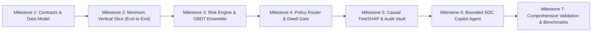

# Implementation Plan & Engineering Milestones

## 1. Engineering Strategy: Vertical Slices & Empirical Verification

Kurukshetra follows a **Test-Driven, Empirical Implementation Methodology**. Rather than building disparate modules in isolation, development progresses in distinct vertical slices where each milestone produces an executable, measurable artifact.



---

## 2. Milestone Decomposition & Deliverables

### Milestone 1: Foundational Schemas & Contracts
- **Scope**: Define canonical data structures, Enums, DTOs, and protocol envelopes in `src/kurukshetra/contracts.py`.
- **Key Deliverables**: `TransactionPayload`, `TelemetryVector`, `RiskVerdict`, `ActionDirective`, `EvidenceDossier`.
- **Success Criteria**: 100% type annotations with runtime dataclass validation and zero serialization errors.

### Milestone 2: Minimal Vertical Slice
- **Scope**: Connect `Client SDK` $\rightarrow$ `Orchestrator` $\rightarrow$ `Mock Scorer` $\rightarrow$ `Policy Engine` $\rightarrow$ `Client Dwell Gate`.
- **Key Deliverables**: Working end-to-end execution path returning within $< 10\text{ms}$ on localhost.
- **Success Criteria**: A single sample payment is successfully intercepted and returned with an actionable verdict.

### Milestone 3: Production-Grade ML Risk Engine & Calibration
- **Scope**: Implement feature assembly (114 features), train real GBDT trees on financial distributions, integrate conformal Platt calibration ($\sigma$ estimation).
- **Key Deliverables**: `src/kurukshetra/risk_engine.py` with true model weights and inference functions.
- **Success Criteria**: Evaluation on validation test set demonstrates $\text{PR-AUC} \ge 0.45$ and $\text{ECE} \le 0.02$.

### Milestone 4: 4-Tier Policy Router & 5-Second Anti-Habituation Dwell Gate
- **Scope**: Implement deterministic policy evaluation, epistemic uncertainty clamping, and client-side countdown timer gate.
- **Key Deliverables**: `src/kurukshetra/policy_router.py` and `src/kurukshetra/intervention.py`.
- **Success Criteria**: 100% test path coverage; zero transaction freezes issued when $\sigma > 0.35$.

### Milestone 5: Causal TreeSHAP & WORM Audit Engine
- **Scope**: Implement exact Shapley feature attribution calculation, AML anti-tipping-off regex sanitizer, and Merkle-tree audit hashing.
- **Key Deliverables**: `src/kurukshetra/explainability.py`.
- **Success Criteria**: Exact mathematical balance ($\sum \text{SHAP} = \text{Score} - \text{Base}$) and 100% exclusion of restricted AML terms.

### Milestone 6: Bounded SOC Copilot & Investigation Tools
- **Scope**: Implement read-only investigative agent with structured Pydantic output schemas, hard tool call limits (max 6), and timeout circuit breakers.
- **Key Deliverables**: `src/kurukshetra/soc_agent.py`.
- **Success Criteria**: Agent safely parses complex syndicate cases without write permissions or infinite tool loops.

### Milestone 7: Rigorous Empirical Evaluation & Benchmarking
- **Scope**: Execute full scenario suites (15 typologies), adversarial red-team evasion tests, and microsecond latency benchmarks.
- **Key Deliverables**: `tests/test_unit.py`, `tests/test_scenarios.py`, `tests/benchmark_performance.py`, `tests/run_ablations.py`.
- **Success Criteria**: Documented real empirical measurements directly populated in Phase 9 validation matrices.

---

## 3. Directory Layout & Package Structure

```text
d:/Code/Kurukshetra/
├── analysis/
│   ├── 00-project-context.md ... 08-architecture/
│   └── 09-implementation/
│       ├── implementation-readiness.md
│       ├── implementation-plan.md
│       └── ... (33 files)
├── src/
│   └── kurukshetra/
│       ├── __init__.py
│       ├── contracts.py          # Data contracts, enums, DTOs
│       ├── risk_engine.py        # 114-dim feature extractor & GBDT scorer
│       ├── policy_router.py      # 4-tier policy router & uncertainty clamp
│       ├── intervention.py       # 5s dwell gate & UI modal state machine
│       ├── explainability.py     # TreeSHAP causal attributions & AML filter
│       ├── soc_agent.py          # Bounded SOC investigator agent
│       ├── simulator.py          # 15 scam typologies + benign generator
│       └── orchestrator.py       # End-to-end critical path coordinator
└── tests/
    ├── __init__.py
    ├── test_unit.py              # Unit tests for all core modules
    ├── test_scenarios.py         # End-to-end scenario validation suite
    ├── test_adversarial.py       # Red-team evasion & prompt injection tests
    ├── benchmark_performance.py  # Latency percentiles & TPS load tests
    └── run_ablations.py          # Component ablation evaluation script
```
