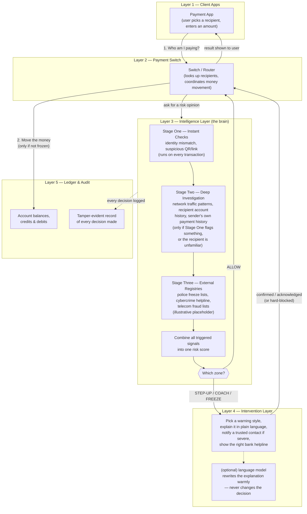

# Kurukshetra — High-Level Design (HLD)

## 1. What the system is

Kurukshetra is an anti-scam intelligence layer that sits between a UPI payment app (like Google Pay), the national payment switch (NPCI), and the banks. It does not replace any of these — it watches two specific moments in an existing payment flow and decides whether to let the payment through, slow it down, warn the user, or block it outright.

It is important to be precise about one thing: **there is no machine learning model and no AI agent framework making the actual risk decision.** The decision is made by a deterministic rules-and-statistics engine — a set of hand-written checks, each producing a score, added together, and compared against fixed thresholds. The only place an AI language model appears is at the very end, and only to rewrite the warning message in a more human, empathetic tone — it never influences whether the transaction is allowed or blocked.

---

## 2. System diagram



*Read top to bottom: a request enters at the app, the switch asks the intelligence layer for an opinion, low-risk traffic sails straight through, anything flagged is routed to the intervention layer for a warning or a hard stop, and every decision — whichever way it went — is written to the audit trail before money ever moves.*

---

## 3. The five layers of the system

Think of the system as five layers stacked on top of each other. A payment request travels down through them, and a decision travels back up.

### Layer 1 — The Client Apps
This is the UPI payment app itself (a simulated Google Pay-like app, plus a landing/marketing site). The user types in who they want to pay and how much. This layer has no intelligence of its own — it just asks the layer below two questions, at two different moments.

### Layer 2 — The Payment Switch
This plays the role of NPCI, the real national body that routes every UPI payment in India. It's the traffic controller. It does two jobs:
- When the user is choosing who to pay, it looks up the recipient's identity and account details.
- When the user is about to actually send money, it coordinates the debit from one bank and the credit to another.

Critically, before it lets either of these things fully complete, it pauses and asks the Intelligence Layer (below) for a risk opinion. It only proceeds if that opinion allows it.

### Layer 3 — The Intelligence Layer (the "brain")
This is the core of Kurukshetra and where almost all the interesting work happens. It is itself organized in escalating stages, so that simple, safe transactions are decided almost instantly, and only suspicious ones get the expensive, deeper investigation. There are three stages:

- **Stage One — Instant Checks.** Runs on every single transaction, in a fraction of a millisecond, using only information already at hand (the recipient's UPI handle text, whether a QR code or payment link was involved). It's checking for obvious red flags — does the recipient's ID claim to be a government office, a bank, or the police while actually being an ordinary personal account? Does the QR code or link look like it's designed to trick someone into paying instead of receiving?

- **Stage Two — Deep Investigation.** Only runs if Stage One found something suspicious, or if the recipient is a stranger the user has never paid before. This stage reaches into three different sources of history:
  - *The switch's own traffic logs* — how many people have looked up this recipient recently, and how many of them actually went through with paying? A huge spike in lookups with almost nobody paying is the fingerprint of a viral scam campaign in progress.
  - *The recipient's banking history* — how old is this account, how was it verified, does money that comes in get emptied out again within minutes, does it only ever receive money and never spend it normally, does its activity look like a call-center's working hours rather than an ordinary person's life?
  - *The sender's own payment history* — is this amount wildly larger than anything they've sent to a new person before, are they sending a rapidly escalating series of payments to the same recipient, are they sending several payments just under a reporting limit in a short window, did they get a tiny refund followed by a demand to send back a huge amount?

- **Stage Three — External Registries.** Represents checks against real national systems that don't exist yet in this build but are designed into the architecture: police fraud-freeze lists, the government cybercrime helpline database, and telecom spam/fraud registries. These are clearly and permanently marked as illustrative placeholders, since real integration would require formal agreements with those government bodies.

Every one of these checks contributes a small or large amount of "risk weight" if it fires. All the weights that fired for a given transaction are added together into a single risk score between 0 and 1, and that score decides which of four zones the transaction falls into:

| Risk Score | Zone | What happens |
|---|---|---|
| 0.00 – 0.30 | **Allow** | Transaction proceeds immediately, no friction |
| 0.31 – 0.65 | **Step-Up** | User must actively confirm before proceeding |
| 0.66 – 0.85 | **Coach** | User must explicitly acknowledge a warning before proceeding |
| 0.86 – 1.00 | **Freeze** | Transaction is hard-blocked; no money moves at all |

There is also a safety rule built in: if the deeper banking data needed to fully evaluate a stranger couldn't be retrieved in time, the system refuses to default to "safe" — it automatically floors the decision at least at Step-Up. Missing information is never treated as a green light.

---

## 3a. The actual formulas — what each check computes

This is the part that's usually glossed over: every "signal" below is a real, specific calculation, not a vague heuristic. Each one either fires (`triggered = true`) or doesn't, and if it fires it adds a fixed **risk weight** to the running total. The final score is simply:

```
risk_score = min(1.0, sum of risk_weight for every check that fired)
```

Nothing is multiplied, normalized, or run through a model — it's a capped sum of independent weights. Below is every check, grouped by which stage it belongs to, with its actual condition and weight as configured in the system today.

### Stage One — Instant Checks (weight fires immediately, no history needed)

| Check | Condition to trigger | Weight added |
|---|---|---|
| **Identity / authority mismatch** | The recipient's handle or the user's stated payment purpose implies an official authority (police, court, tax office, etc.) **AND** the account NPCI returns is an ordinary personal savings account (merchant code `0000`, not a verified government/enterprise code) | **0.40** |
| **Suspicious handle keyword** | The handle text contains an authority/utility keyword (e.g. "cbi", "police", "customs", "tneb", "incometax", "court") **AND** the account is not a verified authority merchant code | **0.35** |
| **QR / payment-link trap** | The scanned QR or opened link contains a pre-filled amount, OR uses a link-shortener domain, OR its note field contains a deceptive term ("kyc", "verify", "cashback", "claim", "reactivate") | **0.30** |

### Stage Two — Deep Investigation (only runs for flagged or unfamiliar recipients)

**Network / switch-level checks** — visible only to the switch because it sees traffic across all payment apps:

- **Verify-to-Abandon Ratio.** For a recipient with at least 10 lookups recorded:
  $$\text{abandon\_ratio} = 1 - \frac{\text{payments completed}}{\text{lookups requested}}$$
  Triggers if `abandon_ratio ≥ 0.85` (i.e. 85%+ of people who checked this account walked away without paying) → **+0.30**

- **Resolution Burst.** Compares the current lookup rate to the account's own historical baseline:
  $$\text{current\_rate} = \frac{\text{total lookups}}{\text{hours since first lookup}}$$
  Triggers if `current_rate > 50 × baseline_rate` and there have been at least 10 lookups total → **+0.35**

**Recipient account (Core Banking) checks** — computed from the recipient's own ledger:

- **Rapid Fund Drainage.** For every inbound credit, measure the time until the next outbound debit; take the **median** of those gaps across the account's history:
  $$T_{\text{residence}} = \text{median}(t_{\text{debit}} - t_{\text{credit}})$$
  Triggers if `T_residence < 300 seconds` (funds are cashed out within 5 minutes of arriving) → **+0.45**

- **One-Way Sink Account.** Compares how many distinct people paid *into* the account versus how many distinct people it paid *out to*:
  $$\text{sink\_ratio} = \frac{\text{unique inbound senders}}{\text{unique outbound recipients}}$$
  Triggers if `sink_ratio ≥ 10`, the account is a personal (non-merchant) account, and it has received at least 5 payments → **+0.40**

- **Burst-Drain-Dormant Lifecycle.** Looks for a dormant account that suddenly wakes up:
  $$\text{drain\_ratio} = \frac{\text{amount withdrawn in last 48h}}{\text{amount received in last 48h}}$$
  Triggers if inflow in the last 48 hours exceeds ₹1,00,000 **AND** `drain_ratio > 0.9` (90%+ of what came in has already left) → **+0.50**

- **Scam Hours Concentration.** Of all credits ever received, what fraction landed on a weekday between 10:00–18:00?
  $$\text{business\_hours\_ratio} = \frac{\text{credits received Mon–Fri, 10:00–18:00}}{\text{total credits}}$$
  Triggers if `ratio ≥ 0.95` with at least 5 credits on record (a genuine personal account gets paid at all hours; this one only gets paid on a call-center's shift) → **+0.20**

- **Recipient Account Graph.** Combines account age, KYC level, and how geographically spread out its recent senders are:
  Triggers (partially or fully) if the account is under 7 days old (**+0.20**) or if its senders in the last 48 hours came from 3+ different states while it only has basic OTP-level KYC (**+0.25**) — the two can stack up to **+0.45**

**Sender's own history checks** — only run once an amount is entered (Moment 2):

- **High-Value Outlier.** Compares the current amount to the sender's own past first-time-payment amounts using a standard Z-score:
  $$Z = \frac{\text{amount} - \mu_{\text{sender's past first-payments}}}{\sigma_{\text{sender's past first-payments}}}$$
  Triggers if `Z > 3.0` (needs at least 3 prior data points to compute) → **+0.30**

- **Drip Escalation.** Compares this payment to the sender's *previous* payment to the same recipient:
  $$\text{amount}_n \geq 2.5 \times \text{amount}_{n-1}$$
  Triggers if the new amount is 2.5× or more of the last one sent to this same recipient → **+0.35**

- **Threshold Evasion (Smurfing).** Looks at all payments to the same recipient in the last 60 minutes:
  $$\sum(\text{amounts in window}) > ₹10{,}000 \quad \text{while every individual amount} < ₹10{,}000$$
  Triggers if there are 3 or more such payments, each individually under the reporting threshold, that together exceed it → **+0.40**

- **Refund Reversal Trap.** Compares a tiny inbound credit to a large outbound request to the same person within 2 hours:
  $$\text{ratio} = \frac{\text{amount now being sent out}}{\text{amount received}}$$
  Triggers if the amount received was ≤ ₹10 and `ratio > 500` → **+0.45**

- **Collect Request Abuse.** For an incoming UPI collect (debit) request, checks whether its note field contains a deceptive term ("claim", "refund", "cashback", "bonus", "receive", "reward") → **+0.50**

- **Purpose Contradiction.** The user declared the payment is for something official (a government fine, court bail, tax penalty) but the recipient's account is an ordinary personal savings account → **+0.40**

- **Post-Hold Escalation.** The sender just completed a payment that had been held for a cooling-off period, and within 5 minutes attempts a *larger* payment to that same recipient (a sign the scammer coached them through the wait) → **+0.50**

**Community reputation check** — Sybil-resistant by design:

- **Community Scam Reports.** Needs at least 3 *distinct* reporters (one report per identity is enforced) before it counts at all:
  $$\text{raw\_score} = \min(1.0,\ 0.2 \times \text{distinct reporters})$$
  That raw score then decays over time with a 14-day half-life:
  $$\text{effective\_score} = \text{raw\_score} \times 0.5^{\,(\text{days since last report} / 14)}$$
  The decayed score itself becomes the risk weight added (capped at 1.0)

### Stage Three — External Registries (illustrative)

Each of these three checks (police Aadhaar/PAN freeze, national cybercrime 1930 registry, telecom spam registry) is a simple **yes/no flag lookup** — if the recipient identifier appears in the (simulated) registry, it triggers with a flat **+0.60** weight. They're structurally wired into the same scoring sum as everything else, but permanently labeled illustrative in the system because no real government data feed exists yet.

### Putting it together — a worked example

Say a user is sending money to a UPI handle containing "cbi" (Stage One authority-keyword check fires, **+0.35**), the account turns out to be under a week old with basic KYC and multi-state senders (Stage Two account-graph check fires, **+0.45**), and three other people have already reported it as a scam (community check, roughly **+0.6** if reports are recent). The running total is capped at **1.0**, which lands the transaction in the **Freeze** zone — hard blocked, zero money moved, regardless of how many other checks did or didn't fire.

### The safety floor (missing-data rule)

If Stage Two can't retrieve full Core Banking data for a stranger recipient in time, the system doesn't just skip those checks and let the score stand — it force-floors the zone at **Step-Up** even if the computed score alone would have landed in Allow. In other words, incomplete information about an unfamiliar recipient is itself treated as a reason for friction.

### Layer 4 — The Intervention Layer
This layer only wakes up if the decision from Layer 3 was Coach or Freeze — for the majority of ordinary, low-risk payments, it does nothing at all. Its job is entirely about *how the warning is communicated to the human*, never about the decision itself:
- It picks which style of warning screen fits the situation best (for example, a screen showing the recipient account's suspicious activity timeline, versus a screen highlighting a contradiction between what the user said the payment was for and what kind of account they're actually sending to).
- It turns the technical reasons behind the flag into a plain-language explanation.
- For the most severe cases, it can simulate notifying a trusted family contact.
- It looks up the right official bank helpline number to display.

This is also the only point in the entire pipeline where a generative language model is optionally consulted — purely to make the plain-language explanation sound warmer and more persuasive to someone who may be in a panicked or coerced state. If that external call fails or isn't configured, the system just uses a pre-written explanation instead, so nothing about the safety behavior depends on it.

### Layer 5 — The Ledger and Audit Layer
Underneath everything is a simulated banking core that actually holds account balances and records every credit and debit, plus a tamper-evident audit trail. Every single decision the intelligence layer makes — allow, step-up, coach, or freeze — is written into this trail in a way where each entry is cryptographically linked to the one before it, so a past decision cannot be quietly edited or deleted later.

---

## 4. The two moments Kurukshetra actually intervenes

Kurukshetra deliberately does not watch everything a user does. It only activates at two precise, well-defined moments in the payment flow — both of which are ones any UPI app already goes through, so no new invasive tracking is introduced:

1. **The moment a recipient is looked up** (typing in a UPI ID or scanning a QR code, before any amount is entered). At this moment, only recipient-side and network-side signals are available, so the checks focus on who this recipient is and what the network has already observed about them.
2. **The moment the user taps "Pay," after entering an amount, but before they enter their PIN.** At this moment the amount is finally known, so a second, deeper pass runs — this time including all the amount-sensitive checks like unusually large payments, escalating payment series, and structured splitting.

Because the decision happens *before* the PIN screen, a Freeze decision can guarantee that zero money ever moves — there's no need to claw anything back afterward.

---

## 5. What is real versus illustrative in this build

Being transparent about the current state of the system:

- **Genuinely computed from live data in this build:** the identity-mismatch checks, the QR/link forensics, the unusually-large-payment check, the escalating-payment check, the structured-splitting check, the tiny-refund-then-big-ask check, and the enforcement flow itself (the actual blocking, confirmation, and settlement logic).
- **Computed from data, but that data is simulated/seeded for demonstration** rather than sourced from a live bank or live NPCI switch: the account-history forensics (drainage speed, sink behavior, dormant-then-burst pattern, working-hours pattern), and the network-wide lookup-abandonment and lookup-burst statistics.
- **Permanently illustrative placeholders**, clearly labeled as such in the system itself, pending real government integration: the police fraud-freeze check, the national cybercrime registry check, and the telecom spam-registry check.

---

## 6. Why it's built this way

The layered, escalating design exists to solve a real tension: a payment system cannot afford to add noticeable delay to the 99% of transactions that are completely legitimate, but it also cannot afford to miss the small minority that are scams. By running only near-instant checks on every transaction and reserving the expensive, multi-source investigation for the transactions that already look suspicious or unfamiliar, the system keeps everyday payments fast while still being thorough exactly when it matters. And by keeping the risk decision itself entirely deterministic and rule-based — with the language model confined to rewording an already-final warning — the system's safety behavior stays predictable, explainable, and auditable, rather than depending on the judgment of a generative model that could behave inconsistently.
