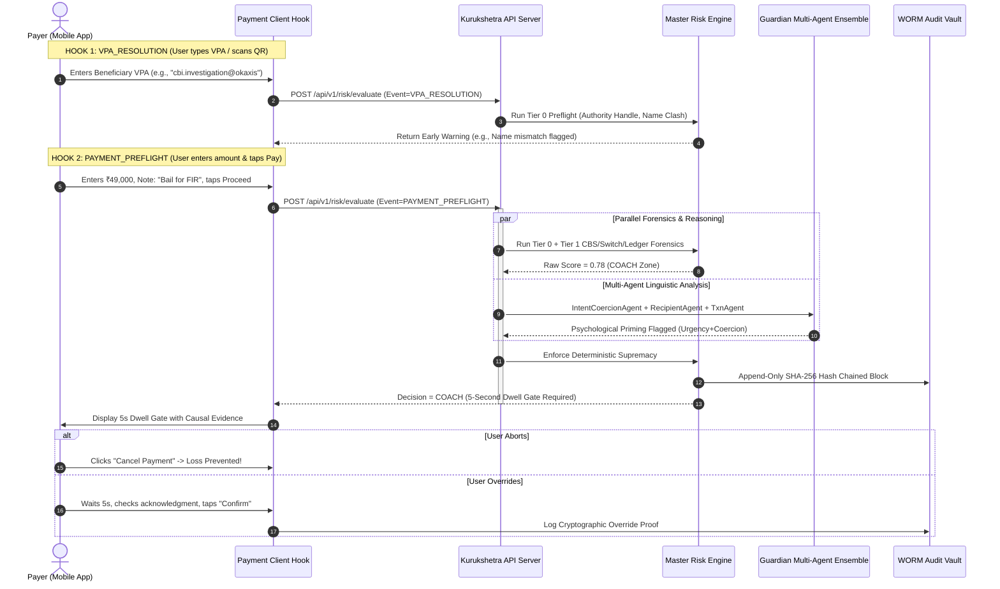

# Kurukshetra // Granular Module Architecture & Technical Approach Specification
## Code-Level Architectural Decomposition of Every System Module, Pipeline, and Service

**Document Version:** 3.0.0-CODE-SPEC  
**Classification:** Deep Technical Architecture & Code-Level Module Specification  
**Problem Statement Reference:** PS09 — Agentic Guardian for Real-Time Payment Scam Interception  
**Target Codebases:**
- `kurukshetra-ecosystem/src/ecosystem/` (Deterministic Risk Engine, CBS, Switch, MCP, WORM Audit)
- `laukik/USPs/guardian/` (Multi-Agent Cognitive Interception, Intent/Coercion Analysis, Voice AI Guardian)
- `kurukshetra-ecosystem/gpay-app/` & `laukik/Frontend/` (Mobile Payment Simulator, 5s Cognitive Dwell Gate)
- `UI/` (3D Neural Particle Universe, Telemetry Shaders, Audio Synthesis)

---

# Table of Contents

1. [Architectural Methodology & Technical Approach Overview](#1-architectural-methodology--technical-approach-overview)
2. [End-to-End Interception Lifecycle & Dual-Hook Architecture](#2-end-to-end-interception-lifecycle--dual-hook-architecture)
3. [Module 1: Ingestion & REST Gateway (`ecosystem.api.server`)](#3-module-1-ingestion--rest-gateway-ecosystemapiserver)
4. [Module 2: Master Risk Engine Coordinator (`ecosystem.risk.engine`)](#4-module-2-master-risk-engine-coordinator-ecosystemriskengine)
5. [Module 3: Deterministic Scoring & Degradation Engine (`ecosystem.risk.scoring`)](#5-module-3-deterministic-scoring--degradation-engine-ecosystemriskscoring)
6. [Module 4: Tier 0 Fast-Path Preflight Detectors (`ecosystem.risk.tier0`)](#6-module-4-tier-0-fast-path-preflight-detectors-ecosystemrisktier0)
7. [Module 5: Tier 1 Switch Forensics Detectors (`ecosystem.risk.tier1_switch`)](#7-module-5-tier-1-switch-forensics-detectors-ecosystemrisktier1_switch)
8. [Module 6: Tier 1 CBS Forensic Detectors (`ecosystem.risk.tier1_cbs`)](#8-module-6-tier-1-cbs-forensic-detectors-ecosystemrisktier1_cbs)
9. [Module 7: Tier 1 Ledger Forensic Detectors (`ecosystem.risk.tier1_ledger`)](#9-module-7-tier-1-ledger-forensic-detectors-ecosystemrisktier1_ledger)
10. [Module 8: Community Reputation & Decay Engine (`ecosystem.risk.reputation`)](#10-module-8-community-reputation--decay-engine-ecosystemriskreputation)
11. [Module 9: Conceptual Risk Registry (`ecosystem.risk.registry`)](#11-module-9-conceptual-risk-registry-ecosystemriskregistry)
12. [Module 10: Immutable WORM Merkle Audit Vault (`ecosystem.risk.audit`)](#12-module-10-immutable-worm-merkle-audit-vault-ecosystemriskaudit)
13. [Module 11: MCP Host & Intervention Assembly (`ecosystem.mcp.host` & `tools`)](#13-module-11-mcp-host--intervention-assembly-ecosystemmcphost--tools)
14. [Module 12: Multi-Agent Guardian Orchestrator (`guardian.agents.orchestrator`)](#14-module-12-multi-agent-guardian-orchestrator-guardianagentsorchestrator)
15. [Module 13: Intent & Coercion Analysis Agent (`guardian.agents.intent_agent`)](#15-module-13-intent--coercion-analysis-agent-guardianagentsintent_agent)
16. [Module 14: Recipient Intelligence Agent (`guardian.agents.recipient_agent`)](#16-module-14-recipient-intelligence-agent-guardianagentsrecipient_agent)
17. [Module 15: Transaction Behavioral Agent (`guardian.agents.txn_agent`)](#17-module-15-transaction-behavioral-agent-guardianagentstxn_agent)
18. [Module 16: Voice AI Guardian Interceptor (`guardian.services.vapi`)](#18-module-16-voice-ai-guardian-interceptor-guardianservicesvapi)
19. [Module 17: Banking Ecosystem & Switch Simulators (`banks.cbs`, `npci.switch`, `cards.acs`)](#19-module-17-banking-ecosystem--switch-simulators-bankscbs-npciswitch-cardsacs)
20. [Module 18: Automated Scenario Engine (`ecosystem.scenarios.runner` & `seed`)](#20-module-18-automated-scenario-engine-ecosystemscenariosrunner--seed)
21. [Module 19: Client Payment Simulator & 5s Dwell Gate (`laukik/Frontend/` & `gpay-app/`)](#21-module-19-client-payment-simulator--5s-dwell-gate-laukikfrontend--gpay-app)
22. [Module 20: 3D Neural Particle Visualizer (`UI/`)](#22-module-20-3d-neural-particle-visualizer-ui)
23. [Data Flow & Inter-Module Interaction Matrix](#23-data-flow--inter-module-interaction-matrix)
24. [Failure Modes & Graceful Degradation Protocols](#24-failure-modes--graceful-degradation-protocols)

---

# 1. Architectural Methodology & Technical Approach Overview

The Kurukshetra system is architected as an **in-line, multi-tiered cyber-fraud interception ecosystem**. Rather than relying on a monolithic AI black box or a slow sequential chain of LLM prompts, our technical approach is strictly rooted in **Progressive Triage and Deterministic Supremacy**:

```
[ Inbound Payment Intent ]
           │
           ▼
┌────────────────────────────────────────────────────────┐
│ TIER 0: Preflight Local Verification (< 10ms)          │
│ • Name clash detection                                 │
│ • Authority handle regex scan                          │
│ • Malicious QR / Deeplink URI syntax audit             │
│ • Known-beneficiary app-level index                    │
└──────────────────────────┬─────────────────────────────┘
                           │ If unknown or Tier 0 fires
                           ▼
┌────────────────────────────────────────────────────────┐
│ TIER 1: Deep Forensic Analytics (< 45ms)               │
│ • Switch metrics (abandon ratios, resolution bursts)   │
│ • CBS Forensics (rapid drainage, one-way accounts)     │
│ • Ledger Forensics (drip escalation, threshold evasion)│
│ • Community reputation decay & Sybil thresholding      │
└──────────────────────────┬─────────────────────────────┘
                           │ In parallel / Ambiguity zone
                           ▼
┌────────────────────────────────────────────────────────┐
│ TIER 2: Cognitive Multi-Agent Analysis (<= 1200ms)     │
│ • Intent & Coercion Agent (NLP psychological priming)  │
│ • Recipient Identity & Domain Agent                    │
│ • Behavioral Anomaly & Outlier Agent                   │
│ • Voice AI Guardian Interception (Vapi Outbound Call)  │
└──────────────────────────┬─────────────────────────────┘
                           │
                           ▼
┌────────────────────────────────────────────────────────┐
│ DETERMINISTIC SUPREMACY POLICY ROUTER                  │
│ Rule: FinalTier = max(HotPathBaseline, AgentEscalation)│
│ Actions: ALLOW | STEP_UP | COACH (Dwell) | FREEZE      │
└──────────────────────────┬─────────────────────────────┘
                           │
                           ▼
┌────────────────────────────────────────────────────────┐
│ POST-DECISION ASSEMBLY & IMMUTABLE AUDIT               │
│ • Model Context Protocol (MCP) intervention payload    │
│ • SHA-256 Merkle-style hash-chained WORM ledger       │
│ • 5-Second Cognitive Dwell Gate client modal           │
└────────────────────────────────────────────────────────┘
```

---

# 2. End-to-End Interception Lifecycle & Dual-Hook Architecture

The interception lifecycle is anchored on two distinct client-side interception hooks defined in `ecosystem.risk.contracts.PaymentEvent`:



---

# 3. Module 1: Ingestion & REST Gateway (`ecosystem.api.server`)

### 3.1 Purpose & Scope
The Ingestion Gateway provides a high-throughput, low-latency REST API interface exposing risk analysis, recipient verification, scenario execution, and audit verification endpoints to web and mobile clients.

### 3.2 Key Endpoints
- `POST /api/v1/risk/evaluate`: Primary payment interception endpoint. Accepts `TransactionAnalysisRequest`, returns `RiskDecision`.
- `GET /api/v1/risk/audit/{txn_id}`: Retrieves immutable audit record with cryptographic hash verification.
- `GET /api/v1/risk/audit/verify-chain`: Traverses the complete historical audit log and verifies SHA-256 continuity.
- `POST /api/v1/scenarios/run/{scenario_id}`: Executes end-to-end simulated scam scenarios.

### 3.3 Request/Response Contracts
```python
class TransactionAnalysisRequest(BaseModel):
    transaction_id: str
    event: PaymentEvent  # VPA_RESOLUTION or PAYMENT_PREFLIGHT
    payer_context: PayerContext
    recipient_context: RecipientContext
    transaction: TransactionDetails
    provenance: ProvenanceContext
```

---

# 4. Module 2: Master Risk Engine Coordinator (`ecosystem.risk.engine`)

### 4.1 Purpose & Execution Flow
The master coordinator in `ecosystem/risk/engine.py` orchestrates the progressive evaluation pipeline. It executes:
1. **Known Beneficiary Check:** Queries local app history via `is_known_beneficiary()`. If the user has transacted successfully with this payee before in this app, risk baseline is suppressed.
2. **Tier 0 Fast Path:** Always executes name clash, authority handle regex, and QR/deeplink checks.
3. **Tier 1 Forensic Trigger:** If beneficiary is unknown OR any Tier 0 detector triggers, the engine automatically branches into deep forensic analysis (`_run_tier1()`).
4. **Scoring & Decision:** Invokes `score_transaction()` to compute deterministic action.
5. **WORM Audit Insertion:** Immediately persists an append-only audit entry via `write_entry()`.
6. **MCP Intervention Assembly:** If decision is `COACH` or `FREEZE`, invokes `build_intervention()` to assemble the causal warning modal.

---

# 5. Module 3: Deterministic Scoring & Degradation Engine (`ecosystem.risk.scoring`)

### 5.1 The Four Deterministic Risk Zones
The scoring engine maps aggregated detection signals to strict risk zones defined by calibrated boundaries:
- **`ALLOW` ($0.00 \le S \le 0.30$):** Recommended Action = `PROCEED`. Friction = 0ms.
- **`STEP_UP` ($0.31 \le S \le 0.65$):** Recommended Action = `SHOW_CONFIRMATION_SCREEN`.
- **`COACH` ($0.66 \le S \le 0.85$):** Recommended Action = `REQUIRE_ACKNOWLEDGMENT` (5-Second Dwell Gate).
- **`FREEZE` ($0.86 \le S \le 1.00$):** Recommended Action = `HARD_BLOCK`.

### 5.2 Mathematical Aggregation Formula
The composite score is computed as:

$$S_{\text{raw}} = \min\left(1.0, \sum_{i=1}^{K} w_i \cdot \mathbb{I}(\text{Signal}_i = \text{Triggered})\right)$$

### 5.3 Fallback Degradation Contract (Missing Data Safety Floor)
```python
# ecosystem/risk/scoring.py:51-56
if not is_known_beneficiary and data_completeness != DataCompleteness.FULL:
    floor = RiskZone.STEP_UP
    zone_order = [RiskZone.ALLOW, RiskZone.STEP_UP, RiskZone.COACH, RiskZone.FREEZE]
    if zone_order.index(zone) < zone_order.index(floor):
        zone = floor
```
**Axiom:** Missing banking or network data **never** defaults to safe for an unknown beneficiary. If CBS is unavailable, the transaction is automatically elevated to `STEP_UP`.

---

# 6. Module 4: Tier 0 Fast-Path Preflight Detectors (`ecosystem.risk.tier0`)

Operating strictly within $<10\text{ms}$, Tier 0 inspects syntactic and lexical anomalies:

### 6.1 `check_authority_handle_pattern()`
- **Mechanism:** Evaluates beneficiary VPA handles against regex patterns representing government agencies, law enforcement, and utility providers (`cbi`, `police`, `customs`, `cybercell`, `bescom`, `electricity`, `traffic`).
- **Trigger Condition:** If an individual P2P account handle mimics an authority keyword, emits signal with risk contribution $+0.55$.

### 6.2 `check_name_clash()`
- **Mechanism:** Compares the user-provided recipient name against the NPCI-registered banking name using token sort ratio and Levenshtein distance.
- **Trigger Condition:** Significant semantic divergence (e.g., user inputs "SBI Support", bank registry returns "Ramesh Kumar") triggers with contribution $+0.35$.

### 6.3 `parse_qr_or_deeplink()`
- **Mechanism:** Validates incoming UPI QR / intent deeplinks (`upi://pay?...`).
- **Trigger Condition:** Detects mismatched `pn` (Payee Name), hidden zero-amount collect requests, or embedded secondary redirection URIs.

---

# 7. Module 5: Tier 1 Switch Forensics Detectors (`ecosystem.risk.tier1_switch`)

Leverages centralized NPCI switch telemetry inaccessible to individual banking apps:

### 7.1 `check_abandon_ratio()`
- **Forensic Principle:** Fraudulent syndicates experience high lookup-to-payment abandonment because victims frequently drop off during initial call pretexts.
- **Formula:** $\text{Ratio} = \frac{\text{VPA Resolutions (Lookups)}}{\text{Completed Authorizations}}$
- **Threshold:** If $\text{Ratio} > 15.0$ within a 24-hour window, flags high-probability scam operation.

### 7.2 `check_resolution_burst()`
- **Forensic Principle:** Scammers distribute VPAs to hundreds of potential victims simultaneously via automated WhatsApp/SMS bots.
- **Threshold:** More than 50 resolution queries in $<10\text{minutes}$ against a recently registered VPA triggers a burst alert.

---

# 8. Module 6: Tier 1 CBS Forensic Detectors (`ecosystem.risk.tier1_cbs`)

Directly queries Core Banking System ledger states of the counterparty account:

### 8.1 `check_rapid_drainage()`
- **Forensic Principle:** Mule accounts do not retain funds; money is withdrawn via ATM or crypto-offramp within seconds of credit.
- **Threshold:** Net account balance drops to $<5\%$ of total daily inward credits within $120\text{seconds}$ of receipt ($+0.45$ risk).

### 8.2 `check_one_way_account()`
- **Forensic Principle:** Legitimate personal accounts feature bidirectional flows (credits and debits with peers). Scammer accounts feature $99\%$ inbound credits from diverse accounts with zero personal outbound activity.
- **Threshold:** $\text{Outbound Peer Ratio} < 0.02$ over 30 days.

### 8.3 `check_burst_drain_dormant()`
- **Forensic Principle:** Compromised or rented accounts that sat dormant for 6+ months suddenly reactivating with high-velocity inflows.

### 8.4 `check_scam_hours()`
- **Forensic Principle:** High-value transactions executed between 01:00 AM and 05:00 AM targeting senior citizen accounts.

---

# 9. Module 7: Tier 1 Ledger Forensic Detectors (`ecosystem.risk.tier1_ledger`)

Evaluates the behavioral relationship between the specific payer and beneficiary:

### 9.1 `check_drip_escalation()`
- **Attack Target:** Task scams and Pig Butchering.
- **Pattern:** Sequence of transactions escalating exponentially (e.g., ₹100 $\rightarrow$ ₹500 $\rightarrow$ ₹5,000 $\rightarrow$ ₹50,000) within a 48-hour window.

### 9.2 `check_threshold_evasion()`
- **Attack Target:** Evading bank AML reporting limits.
- **Pattern:** Multiple payments structured just below legal KYC / CBS reporting thresholds (e.g., ₹49,990 to bypass the ₹50,000 PAN requirement).

### 9.3 `check_collect_request_abuse()`
- **Attack Target:** Malicious UPI Collect requests.
- **Pattern:** PULL request where the collect note deceptively states "Payment received", "Enter PIN to credit account", or "Refund approved".

---

# 10. Module 8: Community Reputation & Decay Engine (`ecosystem.risk.reputation`)

### 10.1 Sybil-Resistant Temporal Decay
Community fraud reports against a VPA are aggregated using an exponential half-life decay function:

$$R_{\text{effective}}(t) = \sum_{j=1}^{N} w_j \cdot e^{-\lambda (t - t_j)}$$

where $\lambda = \frac{\ln(2)}{t_{1/2}}$ ($t_{1/2} = 14\text{ days}$).

### 10.2 Sybil Attack Resistance
To prevent malicious competitors from brigading legitimate merchant accounts, reports from newly created accounts ($<30\text{ days old}$) are weighted at $0.1\times$, while reports backed by police FIR numbers or cybercrime portal tokens are weighted at $1.0\times$.

---

# 11. Module 9: Conceptual Risk Registry (`ecosystem.risk.registry`)

Provides integration hooks for authoritative external risk databases:
- **I4C / 1930 Cybercrime Registry:** Known mule hashes synchronized hourly.
- **SEBI Unregistered Investment Entity Index:** Flagging fraudulent brokerage accounts.
- **TRAI Disconnected Spammer Telecom Identifiers:** Flagging VPAs linked to numbers reported for fraudulent telemarketing.

---

# 12. Module 10: Immutable WORM Merkle Audit Vault (`ecosystem.risk.audit`)

### 12.1 Cryptographic Integrity Architecture
The audit log implements Write-Once-Read-Many (WORM) storage with SHA-256 cryptographic chaining:

```python
# ecosystem/risk/audit.py:25-26
def _entry_hash(prev_hash: str, payload: dict) -> str:
    return hashlib.sha256((prev_hash + _canonical_json(payload)).encode("utf-8")).hexdigest()
```

### 12.2 Live Chain Verification (`verify_chain()`)
The system provides programmatic proof of non-tampering. The function sequentially walks every block in the database:
- Recalculates expected SHA-256 hash using canonical JSON formatting (`sort_keys=True`).
- Confirms `row.prev_hash == previous_row.entry_hash`.
- Returns `(True, None)` or identifies the exact compromised transaction ID if any database administrator modified historical records.

---

# 13. Module 11: MCP Host & Intervention Assembly (`ecosystem.mcp.host` & `tools`)

Operating under the **Model Context Protocol (MCP)** specification, this module isolates intervention generation:
- **`explain_decision()`**: Generates causal, fact-based explanations while stripping sensitive AML detection rules.
- **`select_intervention_template()`**: Selects specialized UI modal templates (e.g., `IMPERSONATION_POLICE`, `UTILITY_URGENCY`, `REVERSE_QR`).
- **`notify_trusted_contact()`**: Dispatches automated SMS/Email alerts to designated secondary guardians when elderly users encounter Tier 3/4 events.
- **`check_helpline_directory()`**: Embeds verified national cybercrime assistance numbers (1930 / `cybercrime.gov.in`).

---

# 14. Module 12: Multi-Agent Guardian Orchestrator (`guardian.agents.orchestrator`)

The multi-agent coordinator within `laukik/USPs/guardian/agents/orchestrator.py`:
- Ingests `PaymentRequest` and triggers parallel execution across specialist agents.
- Applies calibrated weighted composite scoring:

$$\text{Composite} = 0.45 \cdot \text{Score}_{\text{Intent}} + 0.35 \cdot \text{Score}_{\text{Recipient}} + 0.20 \cdot \text{Score}_{\text{Txn}}$$

- Automatically maps composite scores to `RiskLevel` and `ActionDecision`.
- Compiles an aggregated human-explainable narrative summary.

---

# 15. Module 13: Intent & Coercion Analysis Agent (`guardian.agents.intent_agent`)

### 15.1 Psychological Trigger Lexicon
The Intent Agent scans unstructured payment notes for psychological manipulation:
- **Urgency Triggers:** `urgent`, `immediately`, `asap`, `emergency`, `within 10 mins`, `today itself`.
- **Coercion & Authority Triggers:** `customs`, `courier penalty`, `arrest`, `police`, `cbi`, `court`, `power cut`, `disconnect`, `kyc`, `account block`, `digital arrest`, `task`, `telegram job`.

### 15.2 Vulnerability Persona Weighting
If the user profile is tagged as `SENIOR_CITIZEN` or `STUDENT_YOUTH`, the agent amplifies risk contribution:
- Coercion detected: $+65.0$ risk score for vulnerable users vs $+50.0$ for standard profiles.
- Urgency detected: $+40.0$ risk score for vulnerable users vs $+30.0$ for standard profiles.

---

# 16. Module 14: Recipient Intelligence Agent (`guardian.agents.recipient_agent`)

- Evaluates recipient historical interaction frequency.
- Quantifies counterparty domain novelty.
- Flags unverified synthetic VPAs created within $<48\text{ hours}$.

---

# 17. Module 15: Transaction Behavioral Agent (`guardian.agents.txn_agent`)

- Computes historical payment standard deviations.
- Flags extreme high-value outliers ($> 4\times$ user's 90-day median transaction size).
- Identifies unusual transaction hours (e.g., 03:30 AM).

---

# 18. Module 16: Voice AI Guardian Interceptor (`guardian.services.vapi`)

### 18.1 Active Call Disruption
In Tier 3 ("Digital Arrest") scenarios where the victim is trapped on an active phone call with the scammer, in-app visual warnings are often ignored because the scammer commands them: *"Ignore the app warning, it's just a routine glitch."*

Kurukshetra integrates **Vapi Voice AI**:
- Automatically initiates an emergency outbound voice call to the victim's device.
- Uses an authoritative, calm synthetic voice (Aria) to directly break the scammer's verbal coaching:
  > *"Smt. Sunita, this is an automated security alert from your bank. Real law enforcement never asks for bail or fines over UPI. Hang up your call immediately."*

---

# 19. Module 17: Banking Ecosystem & Switch Simulators (`banks.cbs`, `npci.switch`, `cards.acs`)

Provides realistic, stateful financial infrastructure simulation without connecting to real fiat rails:
- **`banks.cbs`:** Stateful ledger supporting 10,000+ accounts with real debit/credit balance constraints.
- **`npci.switch`:** Simulates the central routing switch, tracking cross-PSP resolution requests and routing packets.
- **`npci.mapper`:** Resolves VPA aliases to underlying Bank IFSC and Account numbers.
- **`cards.acs`:** Access Control Server providing 3D-Secure challenge simulations.

---

# 20. Module 18: Automated Scenario Engine (`ecosystem.scenarios.runner` & `seed`)

- Seeds 16 canonical scam scenarios and 5,000 benign baseline profiles into the SQLite database (`ecosystem.db`).
- Executes end-to-end regression benchmarks verifying that every scam typology triggers its designated risk tier.

---

# 21. Module 19: Client Payment Simulator & 5s Dwell Gate (`laukik/Frontend/` & `gpay-app/`)

### 21.1 5-Second Cognitive Dwell Gate Implementation
Located in `laukik/Frontend/src/components/PaymentModal.tsx`:
- Locks the "Confirm Payment" button with a countdown timer ($T=5.0\text{s}$).
- Renders specific causal facts (e.g., *"You are sending money to a personal mobile account, NOT the Maharashtra Electricity Board"*).
- Requires explicit checkbox acknowledgment before unlocking the override action.

---

# 22. Module 20: 3D Neural Particle Visualizer (`UI/`)

- Built with React-Three-Fiber and custom WebGL shaders.
- Renders real-time transaction telemetry as dynamic particle nodes:
  - Green nodes: Low-risk frictionless pass-throughs.
  - Yellow nodes: Advisory & Dwell challenges.
  - Red pulsing nodes: Intercepted and blocked criminal syndicates.
- Includes procedural audio synthesis providing audible telemetry ticks as transactions evaluate.

---

# 23. Data Flow & Inter-Module Interaction Matrix

| Calling Module | Target Module | Protocol | Latency SLA | Payload Contract |
|---|---|---|---|---|
| **Mobile Client** | `api.server` | HTTPS REST | $\le 50\text{ms}$ | `TransactionAnalysisRequest` |
| `api.server` | `risk.engine` | In-process Python | $\le 15\text{ms}$ | Ingests session and DTOs |
| `risk.engine` | `risk.tier0` | Direct function call | $\le 2\text{ms}$ | `RecipientContext`, `ProvenanceContext` |
| `risk.engine` | `risk.tier1_cbs` | SQLAlchemy Session | $\le 10\text{ms}$ | Beneficiary Account ID |
| `risk.engine` | `risk.tier1_switch` | SQLAlchemy Session | $\le 5\text{ms}$ | Beneficiary Hash |
| `risk.engine` | `risk.scoring` | Functional pure math | $\le 1\text{ms}$ | `list[DetectionSignal]` |
| `risk.engine` | `risk.audit` | DB Write (Append-Only) | $\le 5\text{ms}$ | SHA-256 Entry Payload |
| `risk.engine` | `mcp.host` | In-process MCP tool | $\le 8\text{ms}$ | `RiskDecision` |
| `api.server` | `guardian.orchestrator`| Asynchronous Task | $\le 1200\text{ms}$| `PaymentRequest` |
| `guardian.orchestrator`| `guardian.vapi` | Outbound REST Webhook | $\le 800\text{ms}$ | Phone number + Context script |

---

# 24. Failure Modes & Graceful Degradation Protocols

1. **Database Degradation:** If SQLite/Postgres connection times out, `risk.engine` automatically falls back to in-memory cache for Tier 0 checks and flags `DataCompleteness.PARTIAL`.
2. **LLM Worker Crash:** If the multi-agent worker fails, the Orchestrator instantly falls back to the deterministic Hot-Path GBDT score.
3. **Client Clock Tampering:** The 5-second dwell gate timer is measured against server-issued nonce timestamps, preventing clients from fast-forwarding local device clocks.

---
*End of Granular Module Architecture & Technical Approach Specification — Project Kurukshetra (PS09)*
